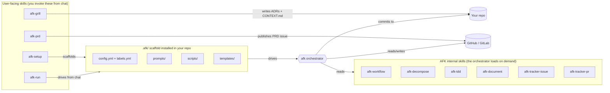
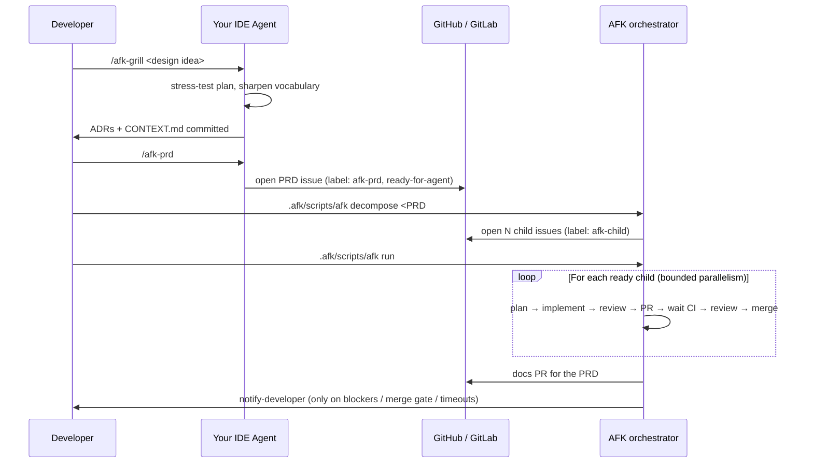
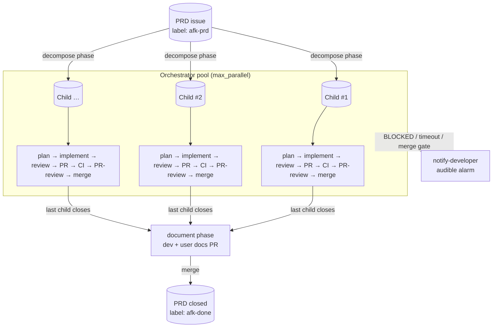

# afk-agent

A universal **Away-From-Keyboard (AFK) agent toolkit** for issue-driven
software development. Decompose a PRD into vertical-slice issues, then let
a bounded pool of background agents implement → review → PR → merge each
one, end with auto-generated docs, and wake you up only when something
genuinely needs a human.

Works with any IDE/agent that supports the
[skills.sh](https://www.skills.sh/) standard — Cursor, Claude Code, Codex,
GitHub Copilot, Windsurf, Gemini, Cline, etc. — and any tracker that
supports the [`gh`](https://cli.github.com/) or
[`glab`](https://gitlab.com/gitlab-org/cli) CLI.

> Heavily inspired by
> [`mattpocock/skills/setup-matt-pocock-skills`](https://www.skills.sh/mattpocock/skills/setup-matt-pocock-skills)
> and battle-tested on real monorepos before being abstracted.

## What's in the box



> **Two ways to run.** Every command shown below works **inside your
> IDE chat** (Cursor / Copilot / Claude / Codex / Windsurf / Gemini)
> via the `/afk-run` skill, OR **in a terminal**. Pick whichever
> feels natural — they share the same state on disk. See
> [docs/MODES.md](./docs/MODES.md) for the run-mode decision tree.

## The three-step user flow



## Quick start (5 minutes)

For the full hand-holding guide, jump to
[**docs/WORKFLOW.md**](./docs/WORKFLOW.md) — it walks you through
every step with mermaid diagrams and "what you'll see" callouts.
Here's the tl;dr:

### 1. Install the skills (once per machine)

```bash
npx skills add Mo-Tamim/afk-agent
```

Registers all 10 `afk-*` skills with your agent runtime. See
[docs/INSTALLATION.md](./docs/INSTALLATION.md) for per-agent details
and the global vs. local install choice.

### 2. Scaffold the orchestrator (once per repo)

**From chat:**

```
/afk-setup
```

The agent interviews you (tracker, agent runner, merge mode), shows
you the resolved config, then scaffolds `.afk/` for you.

**Or from terminal:**

```bash
./install.sh                        # interactive prompts
# or fully non-interactive:
./install.sh --tracker github --repo acme/widget \
             --runner cursor-agent --merge-mode auto
```

### 3. Drive a PRD AFK (once per PRD)

**From chat (all four commands):**

```
/afk-grill <your design idea>           # stress-test → ADRs
/afk-prd                                 # synthesize PRD on tracker
/afk-run decompose <PRD#>                # PRD → child issues
/afk-run process all children of <PRD#>  # orchestrator, inline
```

**Or from terminal:**

```bash
# Steps 1–2 still happen in chat. After /afk-prd:
.afk/scripts/afk decompose 42       # PRD #42 → N child issues
.afk/scripts/afk run                # background orchestrator (parallel)
.afk/scripts/afk status             # snapshot of every in-flight issue
.afk/scripts/afk stop-notify        # silence any wake-up alarm
```

For the chat-vs-terminal decision and how to fully detach the
orchestrator from chat for long runs, see
[docs/MODES.md](./docs/MODES.md).

## Architecture in one diagram



See [docs/ARCHITECTURE.md](./docs/ARCHITECTURE.md) for the full
breakdown of phases, sentinels, and resume semantics.

## Repo layout

```
afk-agent/
├── README.md                      ← you are here
├── install.sh                     ← non-interactive scaffolder
├── package.json                   ← skills.sh metadata
├── skills/                        ← published skills (skills.sh discoverable)
│   ├── afk-setup/SKILL.md          ← /afk-setup
│   ├── afk-grill/SKILL.md          ← /afk-grill
│   ├── afk-prd/SKILL.md            ← /afk-prd
│   ├── afk-run/SKILL.md            ← /afk-run  (chat-window driver)
│   ├── afk-workflow/SKILL.md
│   ├── afk-decompose/SKILL.md
│   ├── afk-tdd/SKILL.md
│   ├── afk-document/SKILL.md
│   ├── afk-tracker-issue/SKILL.md
│   └── afk-tracker-pr/SKILL.md
├── template/                      ← copied into <your-repo>/.afk/
│   ├── AGENTS.md.snippet
│   ├── config.yml
│   ├── labels.yml
│   ├── prompts/                   ← 8 phase prompts
│   ├── templates/                 ← issue / PR / docs templates
│   └── scripts/                   ← orchestrator (bash)
│       └── lib/                   ← common helpers + tracker abstraction
└── docs/
    ├── WORKFLOW.md                 ← READ THIS FIRST
    ├── MODES.md                    ← chat vs terminal vs hybrid
    ├── GLOSSARY.md                 ← every term & abbreviation
    ├── ARCHITECTURE.md
    ├── LIFECYCLE.md
    ├── INSTALLATION.md
    ├── EXTENDING.md
    └── PUBLISHING.md
```

## Where to read next

| If you want to…                              | Read                                                |
|----------------------------------------------|-----------------------------------------------------|
| See a hand-held walkthrough start-to-end     | [docs/WORKFLOW.md](./docs/WORKFLOW.md)              |
| Decide chat-mode vs terminal-mode            | [docs/MODES.md](./docs/MODES.md)                    |
| Look up a term or abbreviation               | [docs/GLOSSARY.md](./docs/GLOSSARY.md)              |
| Understand the architecture                  | [docs/ARCHITECTURE.md](./docs/ARCHITECTURE.md)      |
| Reference the phase lifecycle quickly        | [docs/LIFECYCLE.md](./docs/LIFECYCLE.md)            |
| Install on a different agent / tracker       | [docs/INSTALLATION.md](./docs/INSTALLATION.md)      |
| Add a new tracker, phase, or skill           | [docs/EXTENDING.md](./docs/EXTENDING.md)            |
| Publish your fork to skills.sh               | [docs/PUBLISHING.md](./docs/PUBLISHING.md)          |

## Design principles

- **Skill-native.** Every behavior the agent needs is in a `SKILL.md`
  with frontmatter. Prompts reference skills by name; the agent loads
  them on demand. No giant system prompts.
- **Sentinel-driven.** Each phase ends with exactly one of
  `<promise>COMPLETE</promise>`, `<promise>NO_CHANGES</promise>`, or
  `<promise>BLOCKED</promise>`. The bash orchestrator never inspects
  the agent's prose — only the sentinel.
- **Resume-safe.** Phase completion is recorded in
  `.afk/state/issue-<N>.json`. A crash, reboot, or `Ctrl-C` resumes at
  the next incomplete phase. Idempotent at the tracker layer.
- **Worktree-isolated.** Each in-flight issue gets its own `git
  worktree` under `.afk/worktrees/`, so parallel agents never fight
  over `HEAD`.
- **Tracker-agnostic.** A thin `tracker.sh` wraps `gh` and `glab`
  behind the same verbs. Prompts speak "issue", "PR", "default branch"
  — never "GitHub-specific" things.
- **Agent-agnostic.** The orchestrator shells out to `$AGENT_BIN`, set
  in `config.yml`. Swap `cursor-agent` for `claude` / `codex` /
  `gh copilot` without editing scripts.
- **Wake-up only when needed.** The agent never loops silently on a
  hard block — it triggers
  [`notify-developer`](https://www.skills.sh/) or the configured
  equivalent and stops.

## Status

Pre-release. Tested on Linux (WSL2 Ubuntu) and macOS. Bash 4+, `jq`,
`git` 2.30+, plus one of `gh` / `glab`, plus the agent runner of your
choice.

## License

MIT. See [LICENSE](./LICENSE).
