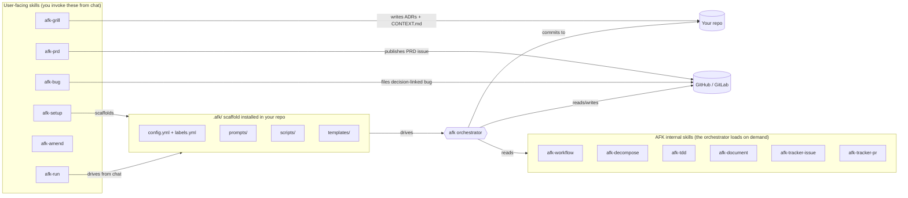
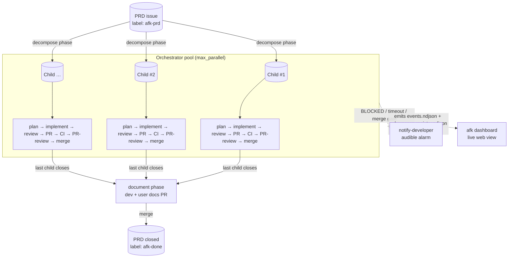
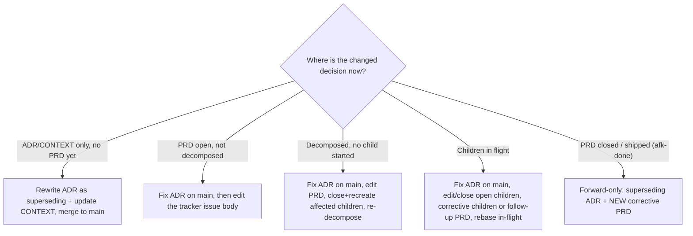
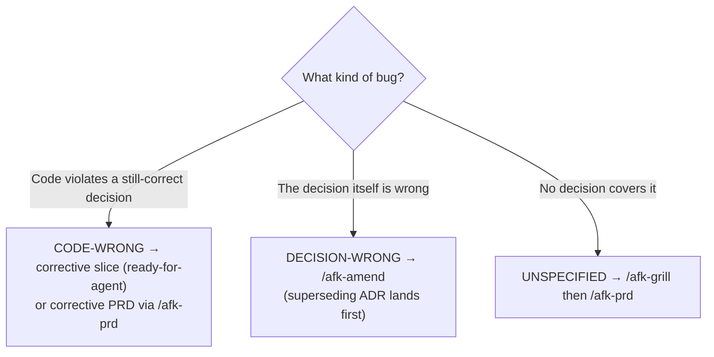

# afk-agent

A universal **Away-From-Keyboard (AFK) agent toolkit** for issue-driven
software development. Decompose a PRD into vertical-slice issues, then let
a bounded pool of background agents implement → review → PR → merge each
one, end with auto-generated docs, and wake you up only when something
genuinely needs a human.

Works with any IDE/agent that supports the
[skills.sh](https://www.skills.sh/) standard — Cursor, Claude Code, Codex,
GitHub Copilot, Windsurf, Gemini, Cline, etc. — and any tracker that
supports the `[gh](https://cli.github.com/)` or
`[glab](https://gitlab.com/gitlab-org/cli)` CLI.

> Heavily inspired by
> `[mattpocock/skills/setup-matt-pocock-skills](https://www.skills.sh/mattpocock/skills/setup-matt-pocock-skills)`
> and battle-tested on real monorepos before being abstracted.

## Table of contents

- [What's in the box](#whats-in-the-box)
  - [Skills at a glance](#skills-at-a-glance)
- [Features](#features)
- [The three-step user flow](#the-three-step-user-flow)
- [Quick start (5 minutes)](#quick-start-5-minutes)
  - [1. Install the skills (once per machine)](#1-install-the-skills-once-per-machine)
  - [2. Scaffold the orchestrator (once per repo)](#2-scaffold-the-orchestrator-once-per-repo)
  - [3. Drive a PRD AFK (once per PRD)](#3-drive-a-prd-afk-once-per-prd)
- [Architecture in one diagram](#architecture-in-one-diagram)
- [Repo layout](#repo-layout)
- [Where to read next](#where-to-read-next)
- [Design principles](#design-principles)
- [Scenarios — when things go sideways](#scenarios--when-things-go-sideways)
  - [Orchestrator was terminated (crash, reboot, Ctrl-C)](#scenario-orchestrator-was-terminated-crash-reboot-ctrl-c)
  - [Issue tagged `afk-blocked](#scenario-issue-tagged-afk-blocked)`
  - [Issue tagged `needs-human](#scenario-issue-tagged-needs-human)`
  - [Merge conflict on the PR](#scenario-merge-conflict-on-the-pr)
  - [CI keeps going red](#scenario-ci-keeps-going-red)
  - [Agent runner died mid-phase (auth, network, OOM)](#scenario-agent-runner-died-mid-phase-auth-network-oom)
  - [Dashboard says "port already in use"](#scenario-dashboard-says-port-already-in-use)
  - [You want to pause without killing the orchestrator](#scenario-you-want-to-pause-without-killing-the-orchestrator)
  - [Two orchestrators stepped on the same issue](#scenario-two-orchestrators-stepped-on-the-same-issue)
  - [The docs PR didn't auto-trigger](#scenario-the-docs-pr-didnt-auto-trigger)
  - [You found an error in an ADR or PRD (or changed your mind)](#scenario-you-found-an-error-in-an-adr-or-prd-or-changed-your-mind)
  - [You (or an agent) found a bug](#scenario-you-or-an-agent-found-a-bug)
- [FAQ](#faq)
- [Status](#status)
- [License](#license)

## What's in the box



### Skills at a glance

Twelve skills ship in this bundle. The **user-facing** ones you invoke
from chat (`/afk-…`); the **internal** ones the orchestrator loads on
demand when a phase prompt names them — you rarely call those directly.

| Skill | Invoked by | When / where in the flow | What it does |
|-------|------------|--------------------------|--------------|
| `afk-setup` | You | Once per repo, before anything else | Scaffolds `.afk/` (config, labels, prompts, scripts, templates) and wires it into your agent rules file. |
| `afk-grill` | You | Start of a PRD, before code | Stress-tests a design one question at a time; captures decisions as ADRs and `CONTEXT.md` entries. |
| `afk-prd` | You | Right after `afk-grill` | Synthesizes the grilling into a PRD and opens it as a tracker issue (`afk-prd`, `ready-for-agent`). |
| `afk-run` | You | Any time you want to drive AFK from chat | Chat-window driver for `decompose` / `run` / `status`; spawns the orchestrator detached when a run outlasts the chat tool. |
| `afk-amend` | You | A recorded **decision changed** (ADR/PRD wrong, or you changed your mind) | Routes the fix by lifecycle state; writes a superseding ADR and lands it on the default branch first. |
| `afk-bug` | You **or** a phase agent | A **defect** is found (reality diverged from a still-correct decision); agents use it for out-of-scope finds | Investigates, files a decision-linked bug (what breaks, which ADRs/PRDs, severity, blast radius, fix-vs-no-fix), and routes it. |
| `afk-workflow` | Orchestrator (internal) | Every phase — shared mental model | Defines the phase lifecycle, branching rules, sentinels, locks, and idempotency contract. |
| `afk-decompose` | Orchestrator (internal) | `decompose` phase | Slices one PRD into vertical-slice child issues using the tracer-bullet pattern. |
| `afk-tdd` | Orchestrator (internal) | `implement` phase | Drives red→green→refactor so each slice ships with behavior-level tests. |
| `afk-document` | Orchestrator (internal) | `document` phase (last child of a PRD closed) | Writes dev + user docs (mermaid required), opens and merges the docs PR. |
| `afk-tracker-issue` | Orchestrator (internal) | Any phase that reads/writes an **issue** | Tracker-agnostic issue CRUD (fetch, comment, label, close) over `gh` / `glab`. |
| `afk-tracker-pr` | Orchestrator (internal) | `pr`, `pr_review`, `pr_merge` phases | Tracker-agnostic PR/MR ops (push, open, poll CI, diff, review, merge). |

> **Two ways to run.** Every command shown below works **inside your
> IDE chat** (Cursor / Copilot / Claude / Codex / Windsurf / Gemini)
> via the `/afk-run` skill, OR **in a terminal**. Pick whichever
> feels natural — they share the same state on disk. See
> [docs/MODES.md](./docs/MODES.md) for the run-mode decision tree.

## Features

### End-to-end automation

- **PRD → child issues → branches → PRs → CI → self-review → squash-merge → docs PR**, all unattended.
- **Auto-rebase** children onto fresh `origin/main` as siblings merge.
- **Auto-generated dev + user docs** (with mermaid) once the last child of a PRD closes.
- **Self-documenting PRs.** The implement phase emits a `<handoff>` with a detailed summary, test plan, and a copy-pasteable **smoke test**, all rendered into the PR body.
- **Smoke-test evidence at merge.** Before merging, the merge phase re-runs the PR's smoke test in the worktree and posts the captured output as evidence; a failing smoke test blocks the merge.
- **Final issue wrap-up.** Each issue gets a closing comment (what shipped, how to smoke test, the PR reference, and why it will close) before the squash-merge auto-closes it.

### Safety & resumability

- **Sentinel-only contract.** The agent's last word — `COMPLETE` / `NO_CHANGES` / `BLOCKED` — is the only thing bash inspects. No prose parsing, no hallucinated state.
- **Resume-safe.** Ctrl-C, crash, or reboot mid-phase resumes at the first not-completed phase via `.afk/state/issue-<N>.json`.
- **Per-issue git worktrees.** Parallel agents never fight over `HEAD`.
- **Per-issue file lock.** The orchestrator refuses to double-process the same issue.
- **Idempotent tracker layer.** The PR phase reuses an existing open PR; the merge phase short-circuits if the PR is already `MERGED`.

### Tooling abstraction

- **Tracker-agnostic.** GitHub (`gh`) and GitLab (`glab`) behind the same verbs; adding Forgejo / Gitea / Linear is one `case` arm in `lib/tracker.sh`.
- **Agent-agnostic.** `cursor-agent`, `claude`, `codex`, `gh copilot`, `gemini`, or any stdin-driven CLI — swap by editing `agent_bin` in `.afk/config.yml`. No script changes.
- **IDE-agnostic.** Anything that supports [skills.sh](https://www.skills.sh/) — Cursor, Claude Code, Copilot Chat, Codex, Windsurf, Gemini, Cline.

### Observability

- **Live web dashboard** at `http://127.0.0.1:8765` — orchestrator status, per-issue phase pipeline, live log tail, worktrees, PR/CI badges. Stdlib-only Python, no `pip install`. See [docs/DASHBOARD.md](./docs/DASHBOARD.md).
- **Structured telemetry.** Every lifecycle transition (`orchestrator_start`, `phase_start`, `agent_spawn`, `phase_end`, …) appends one JSON line to `.afk/logs/events.ndjson` — consumable by the dashboard or any custom downstream.
- **Atomic state files.** `.afk/state/issue-<N>.json` updated via `jq → tempfile → mv` after every phase, so a crash never leaves half-written state.

### Wake-up only when needed

- Audible alarm via the `[notify-developer](https://www.skills.sh/)` skill on `BLOCKED`, CI red past `ci_max_wait_seconds`, merge-gate hit, or `issue_timeout_seconds` exceeded.
- Alarm silences itself on the next agent turn — no manual mute.

### Zero-friction install

- `npx skills add Mo-Tamim/afk-agent` for the skills (once per machine).
- `./install.sh` for the `.afk/` scaffold (once per repo) — local or global scope.
- One JSON config file (`.afk/config.yml`) holds every knob.

## The three-step user flow

```mermaid
sequenceDiagram
  participant Dev as Developer
  participant Agent as Your IDE Agent
  participant Tracker as GitHub / GitLab
  participant AFK as AFK orchestrator

  Dev->>Agent: /afk-grill <design idea>
  Agent->>Agent: stress-test plan, sharpen vocabulary
  Agent->>Dev: ADRs + CONTEXT.md committed
  Dev->>Agent: /afk-prd
  Agent->>Tracker: open PRD issue (label: afk-prd, ready-for-agent)
  Dev->>AFK: .afk/scripts/afk decompose <PRD#>
  AFK->>Tracker: open N child issues (label: afk-child)
  Dev->>AFK: .afk/scripts/afk run
  loop For each child (resume afk-in-progress first, else ready-for-agent; bounded parallelism)
    AFK->>AFK: plan → implement → review → PR → wait CI → review → merge
  end
  AFK->>Tracker: docs PR for the PRD
  AFK->>Dev: notify-developer (only on blockers / merge gate / timeouts)
```


## Quick start (5 minutes)

For the full hand-holding guide, jump to
**[docs/WORKFLOW.md](./docs/WORKFLOW.md)** — it walks you through
every step with mermaid diagrams and "what you'll see" callouts.
Here's the tl;dr:

### 1. Install the skills (once per machine)

```bash
npx skills add Mo-Tamim/afk-agent
```

Registers all 10 `afk-*` skills with your agent runtime. See
[docs/INSTALLATION.md](./docs/INSTALLATION.md) for per-agent details
and the global vs. local install choice.

### 2. Scaffold the orchestrator (once per repo)

**From chat:**

```
/afk-setup
```

The agent interviews you (tracker, agent runner, merge mode), shows
you the resolved config, then scaffolds `.afk/` for you.

**Or from terminal:**

```bash
./install.sh                        # interactive prompts
# or fully non-interactive:
./install.sh --tracker github --repo acme/widget \
             --runner cursor-agent --merge-mode auto
```

### 3. Drive a PRD AFK (once per PRD)

**From chat (all four commands):**

```
/afk-grill <your design idea>           # stress-test → ADRs
/afk-prd                                 # synthesize PRD on tracker
/afk-run decompose <PRD#>                # PRD → child issues
/afk-run process all children of <PRD#>  # orchestrator, inline
```

**Or from terminal:**

```bash
# Steps 1–2 still happen in chat. After /afk-prd:
.afk/scripts/afk decompose 42       # PRD #42 → N child issues
.afk/scripts/afk run                # background orchestrator (parallel)
.afk/scripts/afk status             # snapshot of every in-flight issue
.afk/scripts/afk dashboard          # live web dashboard at http://127.0.0.1:8765
.afk/scripts/afk stop-notify        # silence any wake-up alarm
```

> Want a live picture instead of `status` snapshots? See
> [docs/DASHBOARD.md](./docs/DASHBOARD.md).

For the chat-vs-terminal decision and how to fully detach the
orchestrator from chat for long runs, see
[docs/MODES.md](./docs/MODES.md).

## Architecture in one diagram




See [docs/ARCHITECTURE.md](./docs/ARCHITECTURE.md) for the full
breakdown of phases, sentinels, and resume semantics, and
[docs/DASHBOARD.md](./docs/DASHBOARD.md) for the dashboard.

## Repo layout

```
afk-agent/
├── README.md                      ← you are here
├── install.sh                     ← non-interactive scaffolder
├── package.json                   ← skills.sh metadata
├── skills/                        ← published skills (skills.sh discoverable)
│   ├── afk-setup/SKILL.md          ← /afk-setup
│   ├── afk-grill/SKILL.md          ← /afk-grill
│   ├── afk-prd/SKILL.md            ← /afk-prd
│   ├── afk-amend/SKILL.md          ← /afk-amend  (changed-decision recovery)
│   ├── afk-bug/SKILL.md            ← /afk-bug  (decision-linked defect reports)
│   ├── afk-run/SKILL.md            ← /afk-run  (chat-window driver)
│   ├── afk-workflow/SKILL.md
│   ├── afk-decompose/SKILL.md
│   ├── afk-tdd/SKILL.md
│   ├── afk-document/SKILL.md
│   ├── afk-tracker-issue/SKILL.md
│   └── afk-tracker-pr/SKILL.md
├── template/                      ← copied into <your-repo>/.afk/
│   ├── AGENTS.md.snippet
│   ├── config.yml
│   ├── labels.yml
│   ├── prompts/                   ← 8 phase prompts
│   ├── templates/                 ← issue / PR / docs templates
│   ├── dashboard/                 ← stdlib HTTP server + HTML/JS UI
│   └── scripts/                   ← orchestrator (bash)
│       └── lib/                   ← common helpers + tracker abstraction
└── docs/
    ├── WORKFLOW.md                 ← READ THIS FIRST
    ├── MODES.md                    ← chat vs terminal vs hybrid
    ├── GLOSSARY.md                 ← every term & abbreviation
    ├── ARCHITECTURE.md
    ├── LIFECYCLE.md
    ├── DASHBOARD.md                ← live web dashboard + telemetry
    ├── INSTALLATION.md
    ├── EXTENDING.md
    └── PUBLISHING.md
```

## Where to read next


| If you want to…                          | Read                                           |
| ---------------------------------------- | ---------------------------------------------- |
| See a hand-held walkthrough start-to-end | [docs/WORKFLOW.md](./docs/WORKFLOW.md)         |
| Decide chat-mode vs terminal-mode        | [docs/MODES.md](./docs/MODES.md)               |
| Look up a term or abbreviation           | [docs/GLOSSARY.md](./docs/GLOSSARY.md)         |
| Understand the architecture              | [docs/ARCHITECTURE.md](./docs/ARCHITECTURE.md) |
| Reference the phase lifecycle quickly    | [docs/LIFECYCLE.md](./docs/LIFECYCLE.md)       |
| Watch progress live in a browser         | [docs/DASHBOARD.md](./docs/DASHBOARD.md)       |
| Install on a different agent / tracker   | [docs/INSTALLATION.md](./docs/INSTALLATION.md) |
| Add a new tracker, phase, or skill       | [docs/EXTENDING.md](./docs/EXTENDING.md)       |
| Publish your fork to skills.sh           | [docs/PUBLISHING.md](./docs/PUBLISHING.md)     |


## Design principles

- **Skill-native.** Every behavior the agent needs is in a `SKILL.md`
with frontmatter. Prompts reference skills by name; the agent loads
them on demand. No giant system prompts.
- **Sentinel-driven.** Each phase ends with exactly one of
`<promise>COMPLETE</promise>`, `<promise>NO_CHANGES</promise>`, or
`<promise>BLOCKED</promise>`. The bash orchestrator never inspects
the agent's prose — only the sentinel.
- **Resume-safe.** Phase completion is recorded in
`.afk/state/issue-<N>.json`. A crash, reboot, or `Ctrl-C` resumes at
the next incomplete phase. Idempotent at the tracker layer.
- **Worktree-isolated.** Each in-flight issue gets its own `git worktree` under `.afk/worktrees/`, so parallel agents never fight
over `HEAD`.
- **Tracker-agnostic.** A thin `tracker.sh` wraps `gh` and `glab`
behind the same verbs. Prompts speak "issue", "PR", "default branch"
— never "GitHub-specific" things.
- **Agent-agnostic.** The orchestrator shells out to `$AGENT_BIN`, set
in `config.yml`. Swap `cursor-agent` for `claude` / `codex` /
`gh copilot` without editing scripts.
- **Wake-up only when needed.** The agent never loops silently on a
hard block — it triggers
`[notify-developer](https://www.skills.sh/)` or the configured
equivalent and stops.
- **Observability for free.** Every phase boundary, runner spawn,
  and agent invocation appends one JSON line to
  `.afk/logs/events.ndjson`. Spawn/reap pairs for runners, agent
  wrappers, and timeout sentries also go to
  `.afk/logs/subprocess-registry.ndjson` so the
  [live web dashboard](./docs/DASHBOARD.md) can show a tail and flag
  unexpected live PIDs — no agents instrumented, no extra daemons, no
  databases.

## Scenarios — when things go sideways

Concrete recipes for the situations you'll actually run into during a
real AFK session. For deeper troubleshooting (state-file surgery,
verbose mode, etc.) see [docs/EXTENDING.md § Troubleshooting](./docs/EXTENDING.md#troubleshooting).

### Scenario: Orchestrator was terminated (crash, reboot, Ctrl-C)

State is on disk; resume is built in. **`afk run` also resumes any open
child that still has `afk-in-progress` on the tracker** (ahead of fresh
`ready-for-agent` picks), so you usually do **not** need a manual
`afk issue <N>` after Cursor or the terminal dies — the next pool pass
picks up the interrupted child once its blockers are clear.

```bash
pgrep -af 'orchestrate\.sh|run-issue\.sh|run-phase\.sh'

for f in .afk/state/issue-*.lock; do
  pid="$(cat "$f" 2>/dev/null)"
  [[ -n "$pid" ]] && ! kill -0 "$pid" 2>/dev/null && rm -f "$f"
done

.afk/scripts/afk run
```

`completed_phases` in `.afk/state/issue-<N>.json` is the resume cursor; nothing else needs unsticking for a clean retry. If a **stale** lock
file still references a dead PID, delete it as above — `afk run` will
then dequeue the matching `afk-in-progress` child automatically.

### Scenario: Issue tagged `afk-blocked`

The agent emitted `<promise>BLOCKED</promise>` with a one-line reason. The orchestrator labeled the issue, fired the alarm, and moved on to other queued issues.

```bash
tail -50 .afk/logs/issue-<N>-<phase>-latest/<phase>.log

# … fix whatever the reason says (edit the PRD, write a missing
#   helper, clarify acceptance criteria on the tracker, …)

gh   issue edit <N> --remove-label afk-blocked --add-label ready-for-agent   # GitHub
glab issue update <N> --unlabel afk-blocked --label ready-for-agent          # GitLab
rm -f .afk/state/issue-<N>.lock

.afk/scripts/afk issue <N>
```

### Scenario: Issue tagged `needs-human`

`needs-human` means the orchestrator decided this can't be agent-finished — typically because the planner spotted that the issue crosses package boundaries, or the implementer found the PRD ambiguous. Treat it like a regular issue: pull the work into chat or finish it manually, merge yourself, close the issue. AFK will **not** pick it back up unless you re-label `ready-for-agent`.

### Scenario: Merge conflict on the PR

AFK can rebase but won't resolve real conflicts. When CI flags a conflict (or `pr_merge` returns BLOCKED with reason `conflict`), do it yourself in the worktree:

```bash
cd .afk/worktrees/issue-<N>
git fetch origin && git rebase origin/main
# resolve conflicts in your editor
git add -A && git rebase --continue
git push --force-with-lease

gh   issue edit <N> --remove-label afk-blocked --add-label ready-for-agent
rm -f .afk/state/issue-<N>.lock
.afk/scripts/afk issue <N>            # resumes at pr_wait_ci
```

### Scenario: CI keeps going red

```bash
gh   pr checks <PR#> --watch          # GitHub
glab ci view                          # GitLab (in the worktree dir)
```

If the test failure is real, fix in the worktree and push:

```bash
cd .afk/worktrees/issue-<N>
# … fix …
git commit -am 'AFK: fix flaky timing assertion'
git push
rm -f .afk/state/issue-<N>.lock
.afk/scripts/afk issue <N>
```

If CI is just flaky, bump `ci_max_wait_seconds` in `.afk/config.yml` and retry — but only after you've verified the underlying test isn't legitimately broken.

### Scenario: Agent runner died mid-phase (auth, network, OOM)

Look at the last bytes of the phase log:

```bash
tail -80 .afk/logs/issue-<N>-<phase>-latest/<phase>.log
```

If there's no sentinel (`<promise>…</promise>`) on the final lines, the runner crashed before finishing. Resume the killed phase fresh:

```bash
rm -f .afk/state/issue-<N>.lock
.afk/scripts/afk issue <N>
```

Cursor-agent `Connection lost, reconnecting…` loops are usually transient — wait ~5 min before intervening; the retry typically succeeds and the phase completes normall/reauy.

### Scenario: Dashboard says "port already in use"

Another dashboard or test server is holding `8765`.

```bash
.afk/scripts/afk dashboard --stop                  # kill our backgrounded one
lsof -i :8765 || ss -ltnp '( sport = :8765 )'      # who else?
.afk/scripts/afk dashboard --port 9000             # or just pick a different port
```

### Scenario: You want to pause without killing the orchestrator

Drain instead of stop. Remove `ready-for-agent` from every queued child; in-flight runners finish, no new ones spawn:

```bash
# GitHub
for n in $(gh issue list --label afk-child --label ready-for-agent \
              --state open --json number --jq '.[].number'); do
  gh issue edit "$n" --remove-label ready-for-agent
done

# GitLab
for n in $(glab issue list --label afk-child --label ready-for-agent \
              --output json | jq -r '.[].iid'); do
  glab issue update "$n" --unlabel ready-for-agent
done
```

Re-label any subset to resume.

### Scenario: Two orchestrators stepped on the same issue

Shouldn't happen — per-issue lock files are atomic. But if you see a duplicate PR, pick one to keep, close the other (`gh pr close <PR#>` / `glab mr close <PR#>`), and tell AFK which one is canonical:

```bash
rm -f .afk/state/issue-<N>.lock
jq '.pr = {number: <KEEP_PR#>, url: "<URL>"}' .afk/state/issue-<N>.json \
   | sponge .afk/state/issue-<N>.json
```

### Scenario: The docs PR didn't auto-trigger

The `docs-gate` only runs after every idle pass of the orchestrator. If yours stopped before the gate fired, kick it manually — it's idempotent:

```bash
.afk/scripts/afk document     # opens docs PR for every PRD whose children
                              # are all closed and which isn't yet labeled afk-done
```

### Scenario: You found an error in an ADR or PRD (or changed your mind)

A wrong ADR, a PRD that misstated the work, a misunderstanding baked in at ADR-creation time, and a flat-out change of mind are all the **same event**: a recorded decision changed after it was written down. Use the `/afk-amend` skill — it routes the fix to the right action based on how far the decision has already travelled:



The one rule that holds in every branch: **the corrected ADR/`CONTEXT.md` must be merged to the default branch first.** Every phase derives its worktree from `origin/main`, so an ADR sitting on an unmerged branch is invisible to every agent and the old, rejected decision gets re-implemented. AFK is forward-only — never reopen an `afk-done` PRD; supersede it with a new corrective PRD instead.

### Scenario: You (or an agent) found a bug

A **bug** is reality diverging from a decision that is *still correct* — the code doesn't do what an ADR/PRD says. (Contrast with an **amend**, above, where the decision itself changed.) Use the `/afk-bug` skill. It serves two callers:

- **You, debugging:** `/afk-bug payments are double-charged on retry`. The agent reproduces it, traces it to the ADRs/PRDs it breaks, rates severity, and files a decision-linked bug.
- **A phase agent, mid-run:** when `implement` / `review` / `pr-review` notices a defect *outside* its slice, it files it via `afk-bug` instead of silently fixing it (slice creep) or dropping it on the floor — then finishes its own issue.

Every `afk-bug` issue states what breaks, **which ADR/PRD it violates or threatens**, the blast radius, the severity & urgency, and the **impact of fixing vs. not fixing** — then routes the fix:



For an **S1** bug (data loss, security, prod-down, money-wrong) the skill also labels any in-flight work it would corrupt `afk-blocked` so the orchestrator pauses it. See [skills/afk-bug/SKILL.md](./skills/afk-bug/SKILL.md).

## FAQ

### Q: What happens if I close my laptop mid-run?

In **chat-detached** or **terminal-background** mode the orchestrator continues until the OS suspends it. On wake, it picks up at the first not-completed phase per issue. State files survive sleep, reboot, and SIGHUP. See [docs/MODES.md](./docs/MODES.md).

### Q: Can I run multiple PRDs in parallel?

Yes. `afk run` is PRD-agnostic — it pulls any unblocked `afk-child` issue
that is either **`afk-in-progress`** (auto-resume band, sorted first)
or **`ready-for-agent`**, regardless of which PRD it belongs to.
Decompose two PRDs back-to-back and let the pool drain them.

### Q: How much agent quota does this burn?

Per child: roughly **6 agent invocations** (`plan`, `implement`, `review`, `pr`, `pr_review`, `pr_merge`) plus one `document` per PRD. CI polling uses `gh`/`glab`, not the agent. A 5-child PRD ≈ 31 agent calls.

### Q: Does it work without `gh` / `glab`?

Not out of the box — the orchestrator shells out to one of them for every tracker call. Adding a Forgejo / Gitea / Linear adapter is ~80 lines in `lib/tracker.sh`; see [docs/EXTENDING.md § Add a new tracker](./docs/EXTENDING.md#add-a-new-tracker).

### Q: Can I use AFK without an IDE chat?

Yes. Pure terminal mode works: `./install.sh`, then `.afk/scripts/afk decompose <PRD#>` and `.afk/scripts/afk run`. You skip the `/afk-grill` and `/afk-prd` skills (which need chat) — write the PRD by hand or via `gh issue create`. The orchestrator itself is plain bash.

### Q: Does it ever commit secrets or `.env` files?

The TDD prompt explicitly forbids it, and `.afk/` itself gitignores volatile dirs. But there's no hard barrier — if `.env` is already tracked in your repo, the agent could touch it. Add it to `.gitignore` and (optionally) a pre-commit hook that rejects secret patterns.

### Q: How do I switch from `cursor-agent` to `claude` (or any other runner)?

Edit `.afk/config.yml`:

```yaml
agent_bin: claude
agent_flags: ""        # whatever your claude CLI expects
```

No script changes needed. Smoke-test with: `echo "say hi" | claude` — if you see "hi" on stdout, AFK can drive it.

### Q: What's the difference between `review` and `pr_review`?

`review` runs **locally**, in the worktree, against the implementer's commits — a fast pre-PR cleanup pass. `pr_review` runs against the **open PR's diff** (`gh pr diff` / `glab mr diff`) with a fresh agent (no context bleed) and either approves or BLOCKs. See [docs/LIFECYCLE.md](./docs/LIFECYCLE.md).

### Q: Why doesn't the dashboard show CI?

Either: (a) you passed `--no-tracker`; (b) `gh` / `glab` isn't authenticated (`gh auth status`); or (c) the tracker call is rate-limited (cached for 30 s — wait it out). The phase-pipeline and log-tail panels still work because they're filesystem-only.

### Q: How do I inspect the telemetry stream?

```bash
tail -f .afk/logs/events.ndjson | jq .
```

One JSON object per line. See [docs/LIFECYCLE.md § Telemetry events](./docs/LIFECYCLE.md#telemetry-events) for the `kind` reference.

### Q: Does this work with monorepos?

Yes. The `decompose` phase emits a `package` field per child (read from the PRD's `## Package path` section); the planner uses it to scope the branch and the implementer `cd`s into the worktree which is at repo root. Cross-package children are BLOCKED at plan time so they get sliced thinner.

### Q: Can I review a PR before AFK auto-merges it?

Set `merge_mode: gated` in `.afk/config.yml`. On green CI + approved self-review, AFK pauses and alarms instead of merging. You merge yourself (`gh pr merge` / `glab mr merge`) when ready.

### Q: The agent emitted `NO_CHANGES` — did anything happen?

Yes: the orchestrator recorded the phase as done and advanced. `NO_CHANGES` means the phase had nothing to do (e.g. the reviewer found nothing to clean up). **Exception:** from the `implement` phase, `NO_CHANGES` is a graceful bail — no PR is opened.

### Q: An agent found a bug while working on something else — what happens?

It files it with the `afk-bug` skill and keeps going. The phase prompts (`implement`, `review`, `pr-review`) tell agents not to fix out-of-scope defects inline — that breaks the vertical slice — and not to ignore them either. Instead they raise a decision-linked bug (which ADRs/PRDs break, severity, blast radius, fix-vs-no-fix) on the tracker, labelled `afk-bug`, and finish their own issue. You triage the bug later, or — if it's `ready-for-agent` and agent-sized — let `afk run` pick up the fix. See [skills/afk-bug/SKILL.md](./skills/afk-bug/SKILL.md).

### Q: How do I upgrade an existing repo to a newer AFK?

Re-run `install.sh` with `--force` against the same target. It refreshes `prompts/`, `scripts/`, `templates/`, `dashboard/`, and `.afk/skills/`, but **keeps** `config.yml`, `state/`, `worktrees/`, and `logs/` (including `events.ndjson`):

```bash
cd /path/to/afk-agent
./install.sh --force --no-rules-edit \
  --target /path/to/your/repo \
  --tracker gitlab --repo owner/repo \
  --runner cursor-agent --merge-mode auto
```

## Status

Pre-release. Tested on Linux (WSL2 Ubuntu) and macOS. Bash 4+, `jq`,
`git` 2.30+, plus one of `gh` / `glab`, plus the agent runner of your
choice.

## License

MIT. See [LICENSE](./LICENSE).