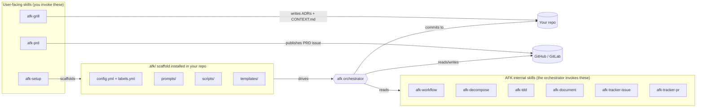
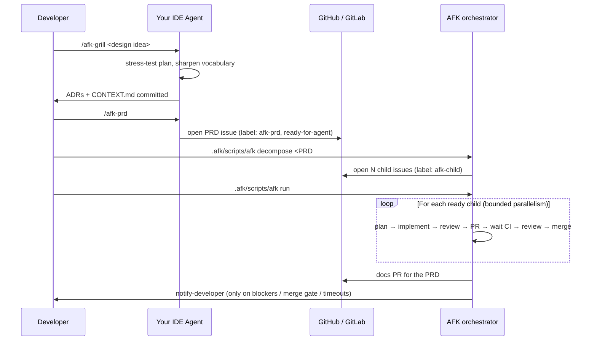
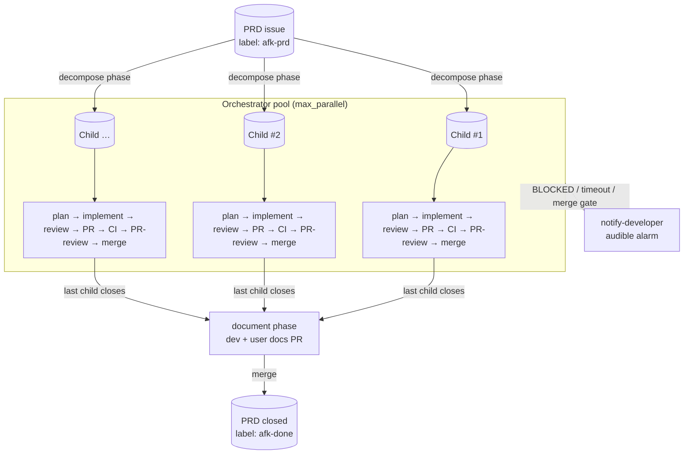

# afk-agent

A universal **Away-From-Keyboard (AFK) agent toolkit** for issue-driven
software development. Decompose a PRD into vertical-slice issues, then let
a bounded pool of background agents implement → review → PR → merge each
one, end with auto-generated docs, and wake you up only when something
genuinely needs a human.

Works with any IDE/agent that supports the
[skills.sh](https://www.skills.sh/) standard — Cursor, Claude Code, Codex,
GitHub Copilot, Windsurf, Gemini, Cline, etc. — and any tracker that
supports the [`gh`](https://cli.github.com/) or
[`glab`](https://gitlab.com/gitlab-org/cli) CLI.

> Heavily inspired by
> [`mattpocock/skills/setup-matt-pocock-skills`](https://www.skills.sh/mattpocock/skills/setup-matt-pocock-skills)
> and battle-tested on real monorepos before being abstracted.

## What's in the box



## The three-step user flow



## Quick start

### 1. Install the skills

```bash
npx skills add Mo-Tamim/afk-agent
```

This registers every `afk-*` skill with your agent runtime (Cursor,
Claude Code, etc.). See [docs/INSTALLATION.md](./docs/INSTALLATION.md)
for per-agent details and global vs. local install.

### 2. Scaffold the orchestrator into your repo

From inside your project, ask your agent:

```
/afk-setup
```

It will interview you about:

- **Issue tracker** — GitHub (`gh`) or GitLab (`glab`)
- **Repo slug** — e.g. `acme/widget` or `acme/widget` (GitLab path)
- **Default branch** — auto-detected from `origin/HEAD`, override if needed
- **Agent runner binary** — `cursor-agent`, `claude`, `codex`, `gh copilot`, …
- **Parallelism cap** — default 3
- **Merge mode** — `auto` (merge on green CI) or `gated` (wait for `/merge`)

…then writes `.afk/config.yml`, `.afk/labels.yml`, the prompts, the
templates, the scripts, and an `## AFK orchestrator` block in your
repo's `AGENTS.md` (or `CLAUDE.md` / `.cursorrules`).

You can also run it non-interactively:

```bash
./install.sh --tracker github --repo acme/widget --runner cursor-agent
```

### 3. Drive a PRD AFK

```bash
# Once your tracker has a PRD issue labelled afk-prd, ready-for-agent:
.afk/scripts/afk decompose 42         # PRD #42 → N child issues
.afk/scripts/afk run                  # background orchestrator, parallel
.afk/scripts/afk status               # snapshot of every in-flight issue
.afk/scripts/afk stop-notify          # silence any wake-up alarm
```

## Architecture in one diagram



See [docs/ARCHITECTURE.md](./docs/ARCHITECTURE.md) for the full
breakdown of phases, sentinels, and resume semantics.

## Repo layout

```
afk-agent/
├── README.md                      ← you are here
├── install.sh                     ← non-interactive scaffolder
├── package.json                   ← skills.sh metadata
├── skills/                        ← published skills (skills.sh discoverable)
│   ├── afk-setup/SKILL.md
│   ├── afk-grill/SKILL.md
│   ├── afk-prd/SKILL.md
│   ├── afk-workflow/SKILL.md
│   ├── afk-decompose/SKILL.md
│   ├── afk-tdd/SKILL.md
│   ├── afk-document/SKILL.md
│   ├── afk-tracker-issue/SKILL.md
│   └── afk-tracker-pr/SKILL.md
├── template/                      ← copied into <your-repo>/.afk/
│   ├── AGENTS.md.snippet
│   ├── config.yml
│   ├── labels.yml
│   ├── prompts/                   ← 8 phase prompts
│   ├── templates/                 ← issue / PR / docs templates
│   └── scripts/                   ← orchestrator (bash)
│       └── lib/                   ← common helpers + tracker abstraction
└── docs/
    ├── ARCHITECTURE.md
    ├── LIFECYCLE.md
    ├── INSTALLATION.md
    ├── EXTENDING.md
    └── PUBLISHING.md
```

## Design principles

- **Skill-native.** Every behavior the agent needs is in a `SKILL.md`
  with frontmatter. Prompts reference skills by name; the agent loads
  them on demand. No giant system prompts.
- **Sentinel-driven.** Each phase ends with exactly one of
  `<promise>COMPLETE</promise>`, `<promise>NO_CHANGES</promise>`, or
  `<promise>BLOCKED</promise>`. The bash orchestrator never inspects
  the agent's prose — only the sentinel.
- **Resume-safe.** Phase completion is recorded in
  `.afk/state/issue-<N>.json`. A crash, reboot, or `Ctrl-C` resumes at
  the next incomplete phase. Idempotent at the tracker layer.
- **Worktree-isolated.** Each in-flight issue gets its own `git
  worktree` under `.afk/worktrees/`, so parallel agents never fight
  over `HEAD`.
- **Tracker-agnostic.** A thin `tracker.sh` wraps `gh` and `glab`
  behind the same verbs. Prompts speak "issue", "PR", "default branch"
  — never "GitHub-specific" things.
- **Agent-agnostic.** The orchestrator shells out to `$AGENT_BIN`, set
  in `config.yml`. Swap `cursor-agent` for `claude` / `codex` /
  `gh copilot` without editing scripts.
- **Wake-up only when needed.** The agent never loops silently on a
  hard block — it triggers
  [`notify-developer`](https://www.skills.sh/) or the configured
  equivalent and stops.

## Status

Pre-release. Tested on Linux (WSL2 Ubuntu) and macOS. Bash 4+, `jq`,
`git` 2.30+, plus one of `gh` / `glab`, plus the agent runner of your
choice.

## License

MIT. See [LICENSE](./LICENSE).
