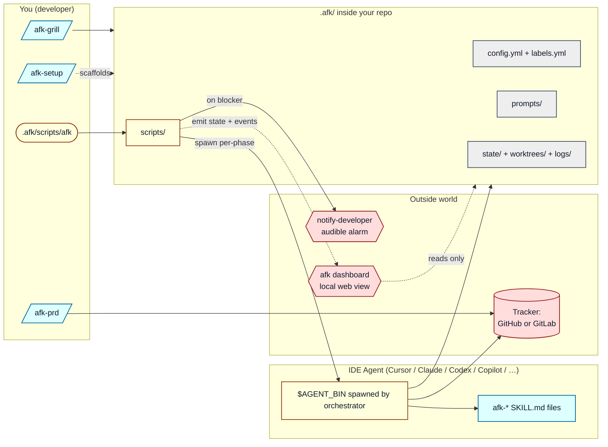
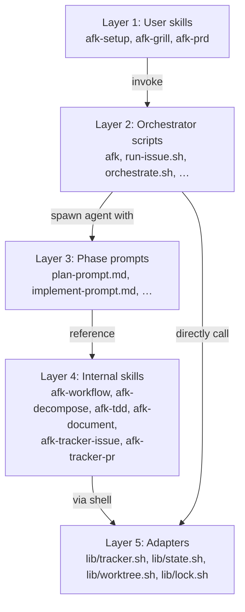
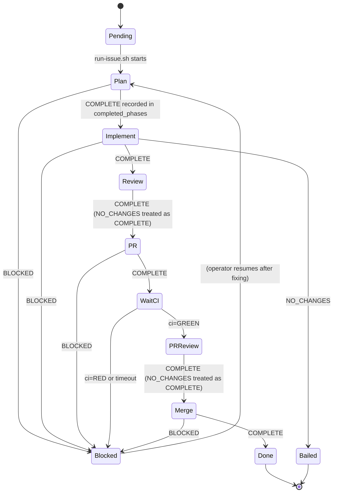
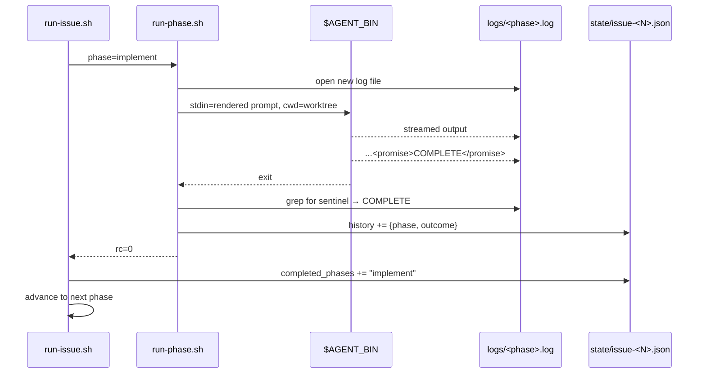
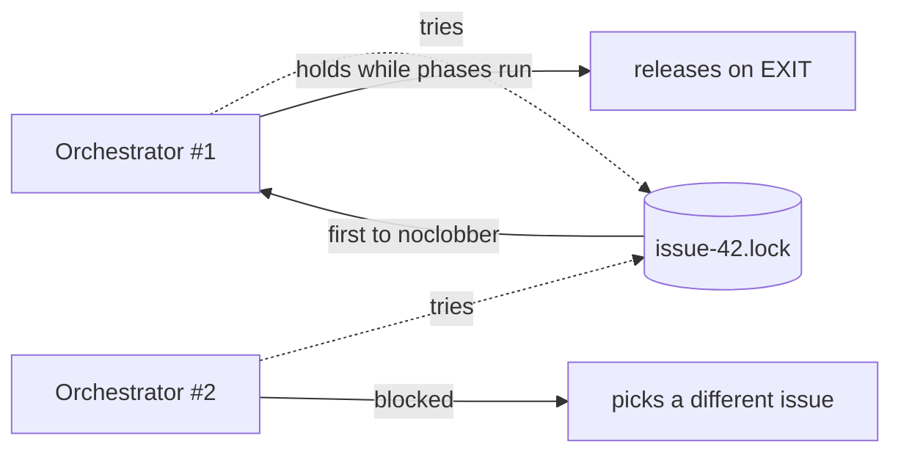
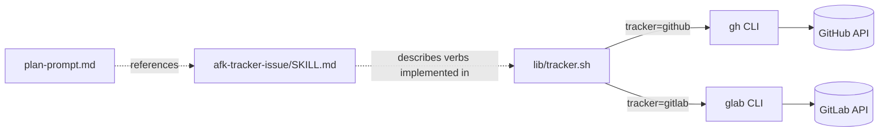
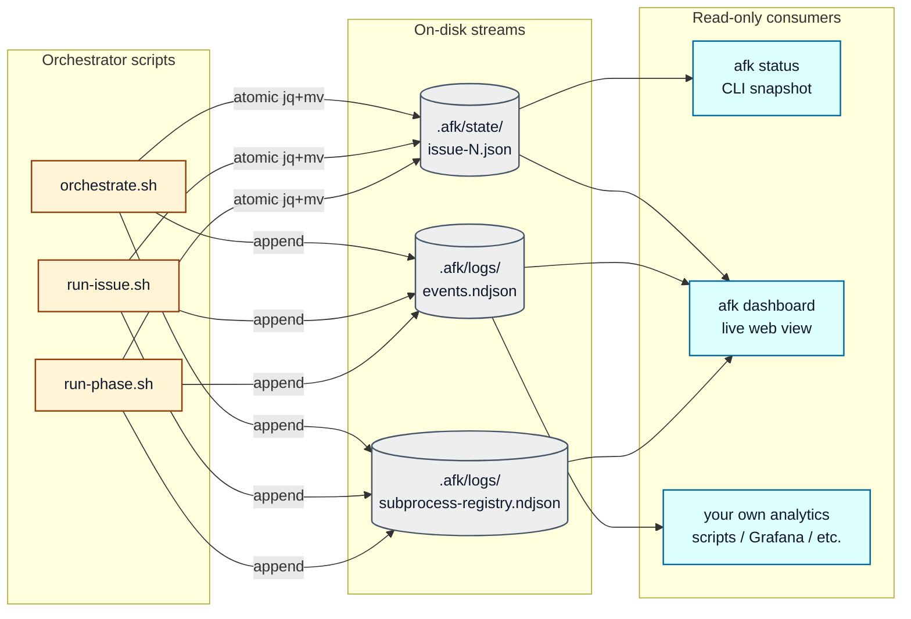

# Architecture

This document explains how `afk-agent` is put together: the pieces, how
they talk to each other, and why each one exists.

## 30-second mental model



Three actors:

- **You** drive the system with three skills (`/afk-grill`, `/afk-prd`,
  `/afk-setup`) and one CLI (`.afk/scripts/afk`).
- **The IDE agent** runs each phase as a fresh, short prompt with the
  skills it needs loaded on demand.
- **The orchestrator** is plain bash. It owns the lifecycle, the
  parallelism, the locks, the state, and the tracker calls — the
  agent does not own those.

## Why the orchestrator is bash, not the agent

The agent is **stateless and fallible**. It crashes, gets rate-limited,
runs out of tokens, hallucinates an extra phase, or simply stops
producing output. If the lifecycle lived inside the agent, every one of
those would corrupt the whole PRD.

The bash orchestrator gives us:

- **Deterministic resume.** State is JSON on disk; a crash mid-phase is
  resumed by re-reading `.completed_phases` and skipping ahead.
- **Bounded parallelism.** A simple `max_parallel` pool of `&` jobs
  plus a per-issue lock file. No coordination service.
- **Sentinel-only contract.** The agent's job is to end its turn with
  exactly one of `<promise>COMPLETE</promise>`,
  `<promise>NO_CHANGES</promise>`, `<promise>BLOCKED</promise>`. Bash
  never reads agent prose.
- **Tool isolation.** Each phase is its own subprocess with its own
  cwd (the issue's worktree), its own log file, and its own timeout.

## The five layers



| Layer | Lives in           | Job                                                  |
|-------|--------------------|------------------------------------------------------|
| 1     | `skills/afk-*/`    | What the **human** invokes                           |
| 2     | `template/scripts/`| Owns the lifecycle; never thinks                     |
| 3     | `template/prompts/`| The instructions handed to one agent for one phase   |
| 4     | `skills/afk-*/`    | What the **agent** loads on demand inside a phase    |
| 5     | `template/scripts/lib/`| Bash adapters: tracker, state, worktrees, locks  |

## Resume semantics



Each `COMPLETE` transition appends the phase to
`.afk/state/issue-<N>.json::completed_phases`. A second invocation of
`afk issue <N>` walks the phase list and skips anything in that array.

Phases that are themselves idempotent at the tracker layer (`pr`,
`merge`) additionally short-circuit on observed remote state — e.g. the
PR phase reuses an open PR for the branch instead of opening a duplicate;
the merge phase emits COMPLETE immediately if the PR is already `MERGED`.

## Sentinel-driven phase handoff



The orchestrator's loop is trivial: render prompt → spawn agent →
grep log → decide rc. Nothing else.

## Locking model



`set -C; > lockfile` is atomic at the filesystem layer — only one
process can win. Stale locks (process gone but file remains) are
reclaimed by checking `kill -0 $pid`.

## Tracker abstraction

`lib/tracker.sh` exposes ~20 verbs (`issue_view_json`, `issue_labels`,
`issue_add_label`, `pr_list_for_branch`, `ci_status`, …) and routes
each one to `gh` or `glab` based on `config.yml`'s `tracker:` value.



Adding a third tracker (Forgejo, Gitea, Linear) is one file: add the
`case "$TRACKER" in <new>) … ;;` arms to `lib/tracker.sh`, plus the
matching authentication step in `ensure-setup.sh`. Prompts and skills
don't change.

## Observability layer

The orchestrator emits two parallel streams that anything else can
read without touching the scripts, plus a **subprocess registry** for
spawn/reap auditing:



- **State files** (`.afk/state/issue-N.json`) are the **resume cursor**.
  Atomically updated via `jq → tempfile → mv`. The single source of
  truth for "is this phase done?".
- **Event stream** (`.afk/logs/events.ndjson`) is the **timeline**.
  Append-only NDJSON, one line per lifecycle transition (see
  [DASHBOARD.md § Telemetry](./DASHBOARD.md#telemetry)). Best-effort —
  scripts continue working even if the file is unwritable.
- **Subprocess registry** (`.afk/logs/subprocess-registry.ndjson`)
  records spawn/reap pairs for issue runners, agent wrappers, and
  timeout sentries so the dashboard can flag unexpected live PIDs and
  operators can audit leaks after crashes.
- All three are **read-only inputs** to downstream tools. Nothing
  in the orchestrator depends on a reader being present. You can
  swap `afk dashboard` for a custom Grafana exporter without
  touching a single phase prompt.

## What ends up where

```
<your-repo>/
├── AGENTS.md                          ← patched with an "AFK orchestrator" section
└── .afk/
    ├── config.yml                     ← tracker, repo, runner, merge mode
    ├── labels.yml                     ← labels to ensure on the tracker
    ├── .gitignore                     ← ignores state/ worktrees/ logs/
    ├── prompts/                       ← 8 phase prompts (committed)
    ├── templates/                     ← child issue / PR / docs templates (committed)
    ├── skills/                        ← copy of afk-* skills (committed; agent loads these)
    ├── scripts/                       ← orchestrator + lib/ + dashboard.sh (committed)
    ├── dashboard/                     ← stdlib HTTP server + HTML/JS UI (committed)
    ├── state/                         ← per-issue JSON state (gitignored)
    ├── worktrees/                     ← per-issue git worktrees (gitignored)
    └── logs/                          ← timestamped phase logs + events.ndjson + dashboard.{log,pid} (gitignored)
```

`.afk/` is fully self-contained: a fresh clone of the repo + a
working `gh`/`glab` + the chosen agent runner is enough to drive AFK
on it. Nothing else needs to be installed globally.

## See also

- [LIFECYCLE.md](./LIFECYCLE.md) — every phase, every sentinel,
  blow-by-blow.
- [DASHBOARD.md](./DASHBOARD.md) — the live web view and telemetry
  stream that ride on top of this architecture.
- [INSTALLATION.md](./INSTALLATION.md) — installer flags, manual
  install, per-agent quirks.
- [EXTENDING.md](./EXTENDING.md) — adding a phase, a tracker, or a new
  agent runner.
