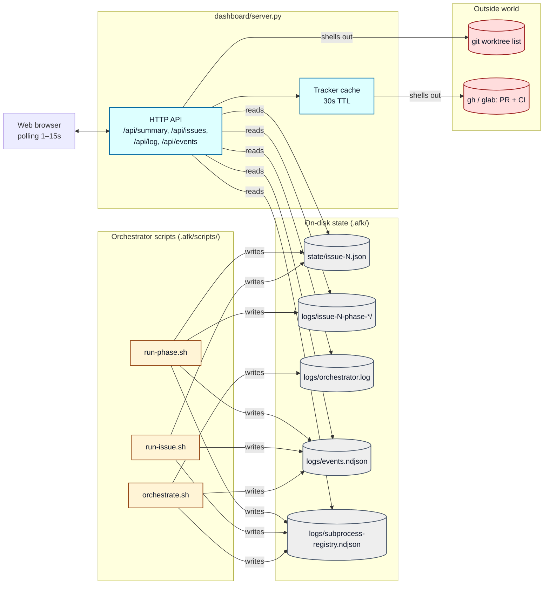
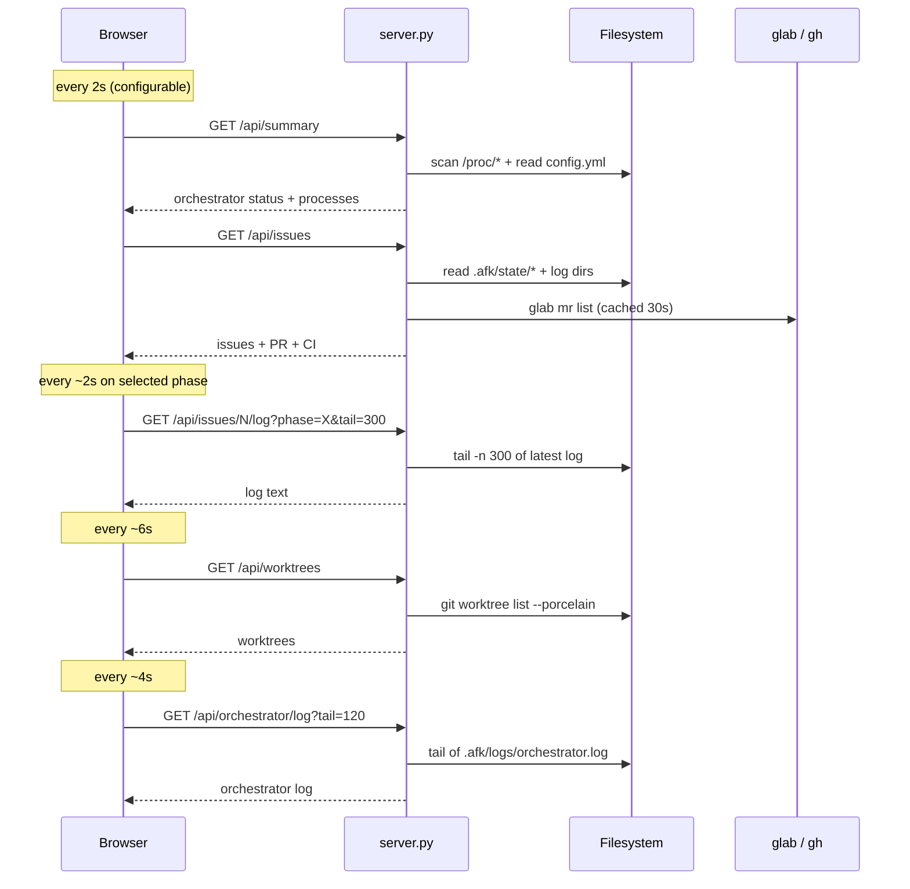
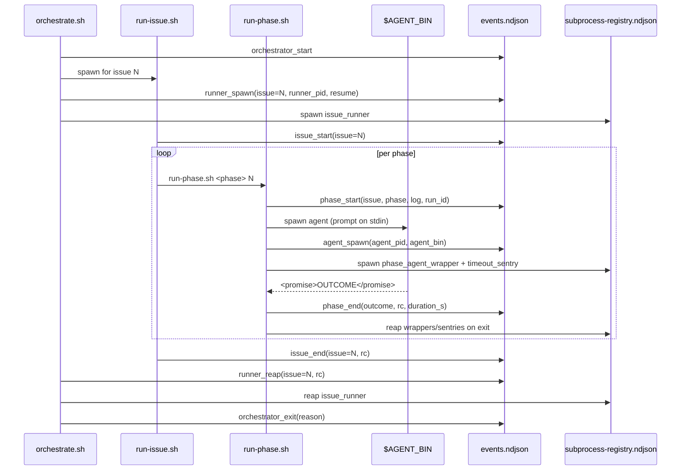

# AFK live dashboard

A single-pane web view of an AFK orchestrator's progress: which issues
are in flight, which phase each one is on, recent log tail, worktrees,
PRs/MRs, and CI status — all auto-refreshing.

The dashboard is **read-only** with respect to AFK's own state. It
reads `.afk/state/issue-*.json`, `.afk/logs/`, `git worktree list`, and
(optionally) `glab`/`gh` for PR + CI. It never writes to those paths.

## Layout at a glance

```
┌──────────────────────────────────────────────────────────────────────┐
│ ● AFK   orchestrator alive · 1 runner · 2 agents      [refresh ▾]    │
├──────────┬───────────────────────────────────────┬───────────────────┤
│ Orchestr │  Issues                                │  Live log         │
│ ──────── │  ────────────────────────────────────  │  ──────────────── │
│ pid …    │  #9  afk/issue-9-config…              │  selecting...     │
│ runners  │  plan→implement→review→pr→…           │                   │
│ phases   │     completed   running                │                   │
│          │                                        │                   │
│ Worktree │  #10  afk/issue-10-ssh-primitive       │  Orchestrator log │
│ Pull req │  plan→implement→…                      │  ────────────     │
└──────────┴───────────────────────────────────────┴───────────────────┘
```

## Data flow

The dashboard is a thin reader on top of the same artifacts the
orchestrator already produces. Nothing in the bash scripts knows the
dashboard exists.



## Polling timeline

Each component refreshes at its own cadence to keep the dashboard
responsive without thrashing the tracker:



## Run it

From the repo containing `.afk/`:

```bash
.afk/scripts/afk dashboard                    # foreground, http://127.0.0.1:8765
.afk/scripts/afk dashboard --port 9000        # custom port
.afk/scripts/afk dashboard --bind 0.0.0.0     # expose on LAN (be careful)
.afk/scripts/afk dashboard --background       # daemonise; pid in .afk/logs/dashboard.pid
.afk/scripts/afk dashboard --stop             # stop the background instance
.afk/scripts/afk dashboard --no-tracker       # skip glab/gh (offline / rate-limited)
```

Requirements: Python 3.8+. No `pip install` needed — the server uses
only the standard library.

In WSL, the launcher tries `wslview` and will open Windows's default
browser at the dashboard URL automatically. Use `--no-browser` to skip.

## What it shows

### Orchestrator panel (left)
- Live / not-live indicator (green = `orchestrate.sh` process found
  under this repo's tree, scanned from `/proc/<pid>/cmdline`).
- PID, uptime, child runner PIDs and the issues they're driving,
  active phase processes, active cursor-agent processes.
- `phases cfg (child)` is `phases:` from `.afk/config.yml` — the
  pipeline for vertical-slice **child** issues.
- `phases cfg (PRD)` is `prd_phases:` when present, else a built-in
  default (`decompose` → `document` → `pr` → `pr_review` → `pr_merge`).
  The server classifies a row as a PRD when state shows a `docs-prd-`
  branch, `decompose` / `document` in `history`, or those phases in
  `completed_phases`.

### Subprocess registry (left, below Orchestrator)
- Tail of `.afk/logs/subprocess-registry.ndjson` (spawn / reap audit).
- Warns when a PID's **last event in the scanned tail** is still
  `spawn` while `/proc/<pid>` exists — normal while a phase is active;
  if it persists after everything should be idle, investigate stray
  `cursor-agent` / wrapper processes.

### Issue cards (middle)
One per `.afk/state/issue-*.json`. Each card shows:
- Issue number, branch, PR/MR link, CI status badge, last update.
- A pipeline of phase chips coloured by status:
  - **green / completed** — in `completed_phases`
  - **blue / pulsing / running** — `run-phase.sh` for that phase is
    currently running, and the active phase is auto-selected in the
    log view on first load.
  - **gray / pending** — not started yet.
  - **red border** — last sentinel was `BLOCKED`.
  - **amber border** — last sentinel was `NO_CHANGES`.
- Click a chip → jumps the log pane to that phase's latest run.
- Click the card body → expands the history timeline.

### Worktrees + PRs (left, lower)
- `git worktree list --porcelain` for the repo: every active
  per-issue worktree under `.afk/worktrees/`.
- Every PR/MR referenced from `state.pr`, with CI badge (GREEN / RED
  / PENDING / NONE). Tracker calls are cached for 30 s.

### Live log (right)
- Reads from `.afk/logs/issue-<N>-<phase>-latest/<phase>.log` (the
  symlink `run-phase.sh` updates after each phase). Falls back to
  `issue-<N>-runner.log` when no phase is selected.
- Configurable tail size (100 / 300 / 1000 / 3000 lines). Pause
  auto-scroll with the ⏸ button when you want to inspect older output.
- The orchestrator log is shown below in a smaller box.

## Telemetry

When run against scripts that include telemetry hooks (everything in
this branch onward), `lib/common.sh::afk::telemetry::emit` appends a
JSON line to `.afk/logs/events.ndjson` at every significant step:



| `kind`              | emitted by         | fields                                          |
| ------------------- | ------------------ | ----------------------------------------------- |
| `orchestrator_start`| `orchestrate.sh`   | `max_parallel`, `tracker`, `repo`               |
| `orchestrator_exit` | `orchestrate.sh`   | `reason`                                        |
| `runner_spawn`      | `orchestrate.sh`   | `issue`, `runner_pid`, `resume` (`1` = tracker had `afk-in-progress`) |
| `runner_reap`       | `orchestrate.sh`   | `issue`, `runner_pid`, `rc`, optional `reason` |
| `issue_start`       | `run-issue.sh`     | `issue`                                         |
| `issue_end`         | `run-issue.sh`     | `issue`, `rc`                                   |
| `phase_start`       | `run-phase.sh`     | `issue`, `phase`, `branch`, `cwd`, `log`, `run_id` |
| `agent_spawn`       | `run-phase.sh`     | `issue`, `phase`, `agent_pid`, `agent_bin`      |
| `phase_end`         | `run-phase.sh`     | `issue`, `phase`, `outcome`, `rc`, `duration_s`, `log`, `run_id` |

The dashboard exposes this stream at `GET /api/events?since=<ts>` so
future panels (timeline view, queue throughput, blocked-rate dashboards)
can be added without touching the orchestrator again.

Telemetry is **best-effort**: any failure in `afk::telemetry::emit` is
silently swallowed. Orchestrator behavior is unchanged when telemetry
fails.

## HTTP API

Stable enough to script against. All endpoints return JSON unless
noted; everything is read-only.

| Path                                 | Description                                              |
| ------------------------------------ | -------------------------------------------------------- |
| `GET /api/summary`                   | Orchestrator status, process tree, config                |
| `GET /api/issues`                    | All issues with computed pipeline + PR + CI              |
| `GET /api/issues/<N>`                | One issue, plus every phase run on record                |
| `GET /api/issues/<N>/log?phase=<p>&tail=N` | text/plain — tail of the latest run of `<phase>`    |
| `GET /api/issues/<N>/runner-log?tail=N` | text/plain — tail of `issue-<N>-runner.log`          |
| `GET /api/orchestrator/log?tail=N`   | text/plain — tail of `.afk/logs/orchestrator.log`        |
| `GET /api/worktrees`                 | `git worktree list --porcelain` parsed                   |
| `GET /api/events?since=<epoch>&limit=N` | NDJSON events since timestamp                         |
| `GET /healthz`                       | text/plain `ok`                                          |

Default bind is `127.0.0.1`. Bind to `0.0.0.0` only if your network is
trusted — the dashboard exposes log contents, which can include
prompts, paths, and stack traces.

## Limitations

- The `/proc`-based orchestrator detection is Linux-only. On macOS the
  alive/dead badge will always read "dead" but everything else (issues,
  logs, worktrees, PRs) still works because it's filesystem-based.
- Tracker calls go through your local `gh` / `glab` auth. If those are
  rate-limited, pass `--no-tracker` to skip them.
- The dashboard is intentionally single-tenant: one HTTP server per
  AFK repo. To watch several repos, run several dashboards on
  different ports.

## Extending

The dashboard reads four classes of input — to add a new panel,
extend the server.py reader or add a new endpoint:

| Input                                     | Reader function           | Notes                          |
|-------------------------------------------|---------------------------|--------------------------------|
| `.afk/state/issue-*.json`                 | `load_state()`            | Per-issue resume state         |
| `.afk/logs/issue-N-phase-<run>/*.log`     | `list_phase_logs()` + `tail_file()` | Phase runs with mtime + size |
| `.afk/logs/orchestrator.log`              | `tail_file()`             | Plain text tail               |
| `.afk/logs/events.ndjson`                 | `read_events()`           | Filter by `since=<epoch>`     |
| `git worktree list --porcelain`           | `list_worktrees()`        | 10 s timeout                  |
| `glab mr list` / `gh pr list`             | `tracker_pr_for_branch()` via `TrackerCache` | 30 s TTL |

For more advanced panels (timeline view, throughput, queue depth) the
`events.ndjson` stream is the right input — it's append-only,
strictly-ordered, and machine-parseable. See
[EXTENDING.md § Add a dashboard panel](./EXTENDING.md#add-a-dashboard-panel).
