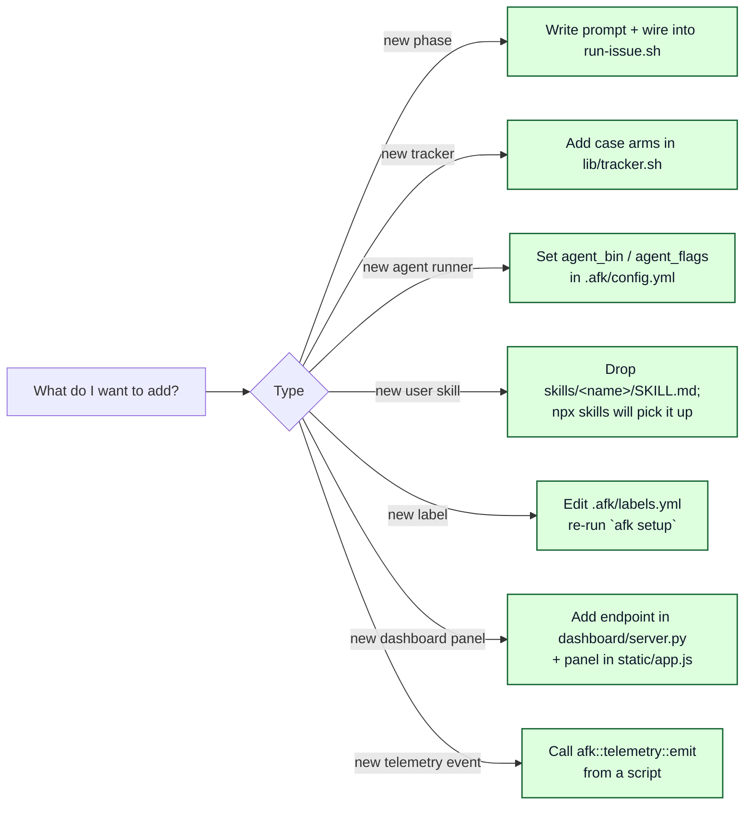
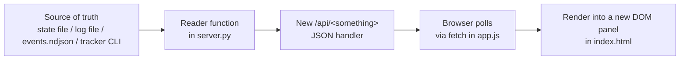
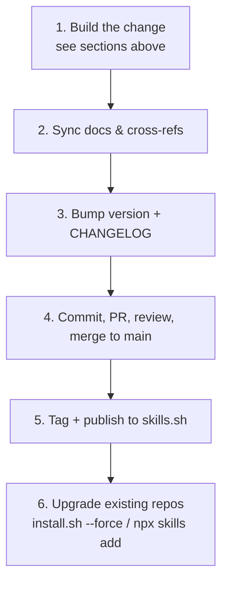
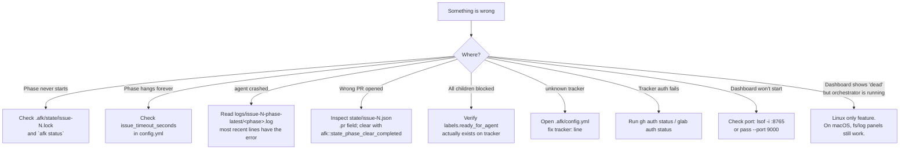

# Extending afk-agent

How to add a phase, a tracker, a runner, or a new user-facing skill.

## Mental map



## Add a new phase

A phase is **one prompt + one sentinel contract + one slot in
`run-issue.sh`**.

1. Write `template/prompts/<phase>-prompt.md`. Take inputs via
   `{{VAR}}` placeholders rendered by `run-phase.sh`. Emit exactly one
   sentinel at the end.

2. Wire it into `run-issue.sh`:

   ```bash
   if afk::state_phase_completed "$ISSUE" <phase>; then
     afk::log "skipping <phase> (already completed)"
   else
     run_phase <phase> "<EXTRA_VAR=val>"
     case "$PHASE_RC" in
       0)  afk::state_phase_mark_completed "$ISSUE" <phase> ;;
       10) afk::warn "NO_CHANGES; …" ;;
       *)  afk::tracker::issue_add_label "$ISSUE" "$BLOCKED_LBL"
           exit "$PHASE_RC" ;;
     esac
   fi
   ```

3. (Optional) If the phase emits a payload, persist it in
   `run-phase.sh`'s payload-extraction `case`:

   ```bash
   case "$PHASE" in
     ...
     <phase>) afk::payload "$LOG" <tag> > "$LOG_DIR/<tag>.json" 2>/dev/null || true ;;
   esac
   ```

4. Add the phase to `config.yml`'s documentation comment and update
   `docs/LIFECYCLE.md`'s reference table.

## Add a new tracker

Two files change.

### `template/scripts/lib/tracker.sh`

Add a new arm to every `case "$TRACKER" in` block. Use the CLI of
your choice (`forgejo`, `tea`, `linear`, your own wrapper). The
public verbs that must work:

```
issue_view_json / issue_state / issue_labels
issue_add_label / issue_remove_label
issue_comment / issue_close / issue_create
open_afk_children / open_afk_prds
blockers (parses Markdown — no tracker work)
pr_list_for_branch / pr_view_json / ci_status / pr_merged_for_issue
```

Each verb returns either JSON-parseable text via `jq` or a single
scalar — keep the contract.

### `template/scripts/ensure-setup.sh`

Add a new arm for the auth check and label creation. Translate the
hex color → whatever syntax the new tracker accepts.

### Update the skills

`skills/afk-tracker-issue/SKILL.md` and `skills/afk-tracker-pr/SKILL.md`
list the CLI commands the agent uses inside a phase. Add the
equivalent commands for your new tracker so the agent learns them
on demand.

That's it — no prompt or orchestrator change.

## Add a new agent runner

Pure config. In `.afk/config.yml`:

```yaml
agent_bin: my-custom-agent
agent_flags: "--quiet --max-tokens 16384"
```

The runner contract is:

- Reads the prompt on **stdin**.
- Writes its work to **stdout**.
- Exits when the turn ends.
- Emits one of `<promise>COMPLETE</promise>`,
  `<promise>NO_CHANGES</promise>`, `<promise>BLOCKED</promise>` on
  the last meaningful line.

If your runner can't read stdin, wrap it in a tiny shell script that
captures stdin to a temp file and passes the path via a flag.

## Add a dashboard panel

The dashboard (`template/dashboard/`) is intentionally small: a
stdlib HTTP server plus one HTML page with vanilla JS. There's no
build step.



Recipe:

1. **Pick the input.** Pre-existing readers cover state, logs,
   events, worktrees, and tracker PRs (see
   [DASHBOARD.md § Extending](./DASHBOARD.md#extending)). For a
   custom source (a third-party CLI, a metric file, …), add a
   small reader function alongside them.
2. **Add the endpoint.** In `template/dashboard/server.py`'s
   `Handler.do_GET`, add a new branch:

   ```python
   elif path == "/api/my-panel":
       self._send_json({"things": my_reader(self.dashboard.afk_root)})
   ```
3. **Fetch from the UI.** In `template/dashboard/static/app.js`, add
   a `jget("/api/my-panel")` call inside `tick()` (or a slower
   sub-tick if appropriate).
4. **Render.** Either reuse a `.panel` div in `index.html` or add a
   new column. Styles live in `static/styles.css` — keep the new
   block CSS-only, no preprocessor.

Because the dashboard is read-only by contract, **do not** add a
`POST` endpoint that mutates `.afk/state/` or the tracker — go
through `.afk/scripts/afk` for any side effect.

## Add a new telemetry event

`afk::telemetry::emit` is the single emit primitive. To record a
new lifecycle moment:

```bash
# Inside any orchestrator script
afk::telemetry::emit my_event \
  issue   "$ISSUE" \
  phase   "$PHASE" \
  detail  "anything you want to surface"
```

Reserved fields (`ts`, `ts_epoch`, `kind`, `scope`, `pid`) are
injected automatically; everything else is your `k v` payload. The
function is best-effort — never wrap it in a critical-path check.

Document the new `kind` in:

- [DASHBOARD.md § Telemetry](./DASHBOARD.md#telemetry) — table of
  emitted events.
- [LIFECYCLE.md § Telemetry events](./LIFECYCLE.md#telemetry-events) — mermaid timeline if it
  belongs in the per-issue flow.

## Add a new user-facing skill

Drop a directory under `skills/`:

```
skills/
└── my-new-skill/
    └── SKILL.md
```

`SKILL.md` must have a YAML frontmatter:

```markdown
---
name: my-new-skill
description: One-sentence trigger. Use when the user says "X" or "Y".
---

# Skill: my-new-skill

(body explaining what the agent should do, with worked examples,
templates, quality gates, and failure modes.)
```

Re-publish via `npx skills add <repo>` or whatever you use; the new
skill ships alongside the existing `afk-*` family.

## Ship a feature — the update & release checklist

Adding the code (above) is only half the job. A feature isn't "shipped"
until the **docs are in sync**, the **version is bumped**, it's
**published**, and **existing repos can pull it**. Run this loop every
time you land a feature.



### 1. Build the change

Use the matching recipe above (new phase / tracker / runner / skill /
label / dashboard panel / telemetry event).

### 2. Sync docs and cross-references

This is the step that rots fastest. Which files to touch depends on
**what** you added:

| You added… | Update these |
|------------|--------------|
| **A skill** | `README.md` (the *What's in the box* mermaid diagram, the *Skills at a glance* table, and the repo-layout tree), `docs/GLOSSARY.md` (a term entry + the skill **count** "ships N of them"), `docs/WORKFLOW.md` (the skill count in step 0 **and** the `installed N skills` line; cheat-sheet if user-facing). If it's a recovery/escape-hatch skill, add a *Scenario* to `README.md` and `WORKFLOW.md`. |
| **A label** | `template/labels.yml` (the source of truth), `docs/GLOSSARY.md` (term entry **and** the colour table at the bottom). Existing repos pick it up only after `afk setup` (see step 6). |
| **A phase** | `docs/LIFECYCLE.md` (phase reference table + sentinel diagram), `docs/WORKFLOW.md` (per-child sequence), `docs/ARCHITECTURE.md` (layer map), `template/AGENTS.md.snippet` (phase-lifecycle line), `template/config.yml` (doc comment). |
| **A tracker** | `skills/afk-tracker-issue/SKILL.md`, `skills/afk-tracker-pr/SKILL.md`, `docs/EXTENDING.md` (mention support), `README.md` (tracker-agnostic claims). |
| **A dashboard panel / telemetry event** | `docs/DASHBOARD.md`, `docs/LIFECYCLE.md § Telemetry events` (for events). |

> **Skill-count grep.** After any skill add/remove, make sure no stale
> count survives:
>
> ```bash
> git grep -nE "eleven|twelve|installed [0-9]+ skills|ships [a-z]+ of them"
> ```
>
> Update every hit so the diagram, the table, the tree, and the prose
> counts agree.

### 3. Bump the version and the changelog

Follow the semver discipline in
[PUBLISHING.md § Version & changelog](./PUBLISHING.md#version--changelog-discipline):

- Edit `package.json`'s `version`.
- Add a `CHANGELOG.md` entry (create the file if missing) summarising the
  delta — one line per user-visible change.
- Choose the bump: **patch** (doc/typo/fix), **minor** (new skill, new
  tracker, new optional config), **major** (changed sentinel contract,
  renamed config keys, removed phase — anything that breaks existing
  `.afk/` installs).

### 4. Commit, PR, review, merge

Land it on the default branch through a normal PR (the same loop you'd
run for any change). Keep the commit message scoped, e.g.
`feat(afk-bug): add decision-linked bug-reporting skill`.

### 5. Tag and publish

```bash
git tag vX.Y.Z
git push --tags
```

Then follow [PUBLISHING.md § Publish](./PUBLISHING.md#publish) to push to
the public repo and let skills.sh re-crawl. Verify with
`npx skills search afk-agent` — the new skill (and the updated count)
should appear.

### 6. Upgrade existing repos

A feature in the bundle does **not** reach a repo that already ran
`afk-setup` until that repo refreshes its `.afk/` scaffold.

```bash
# From a checkout of the afk-agent toolkit, pointed at the target repo:
./install.sh --force --no-rules-edit \
  --target /path/to/your/repo \
  --tracker github --repo owner/repo \
  --runner cursor-agent --merge-mode auto
```

`--force` refreshes `prompts/`, `scripts/`, `templates/`, `labels.yml`,
`dashboard/`, and `.afk/skills/`, but **keeps** `config.yml`, `state/`,
`worktrees/`, and `logs/`. Then, because `labels.yml` changed, register
any new labels on the tracker:

```bash
.afk/scripts/afk setup        # idempotent; creates only missing labels
```

Users who installed the skills via `npx` also re-run
`npx skills add <handle>/afk-agent` to pull the new `SKILL.md` files into
their agent's skills directory.

> **Heads-up:** `install.sh --force` overwrites `.afk/labels.yml` with the
> bundle's copy. If a downstream repo hand-edited that file, reconcile
> before refreshing.

## Troubleshooting



### Quick recovery recipes

**Force-reset one phase** (after fixing an underlying issue):

```bash
jq '.completed_phases |= map(select(. != "implement"))' \
  .afk/state/issue-42.json | sponge .afk/state/issue-42.json
.afk/scripts/afk issue 42
```

**Manually unstick a blocked issue**:

```bash
gh issue edit 42 --remove-label afk-blocked --add-label ready-for-agent
rm -f .afk/state/issue-42.lock
.afk/scripts/afk issue 42
```

**Wipe and redo an issue from scratch** (destructive):

```bash
rm -f .afk/state/issue-42.json .afk/state/issue-42.lock
rm -rf .afk/worktrees/issue-42
git worktree prune
git branch -D afk/issue-42-* 2>/dev/null
gh issue edit 42 --remove-label afk-blocked --remove-label afk-in-progress --add-label ready-for-agent
.afk/scripts/afk issue 42
```

**Verbose mode**:

The bash scripts respect `set -x` via `BASH_XTRACEFD`. Quick form:

```bash
bash -x .afk/scripts/afk issue 42 2>&1 | tee /tmp/afk-trace.log
```

**Dashboard stuck or stale**:

```bash
# Kill any orphaned server (no-op if none)
.afk/scripts/afk dashboard --stop

# Restart in foreground to see startup errors
.afk/scripts/afk dashboard --no-tracker      # skip glab/gh if those are flaky

# Verify the events stream is being written
tail -n 5 .afk/logs/events.ndjson
```
