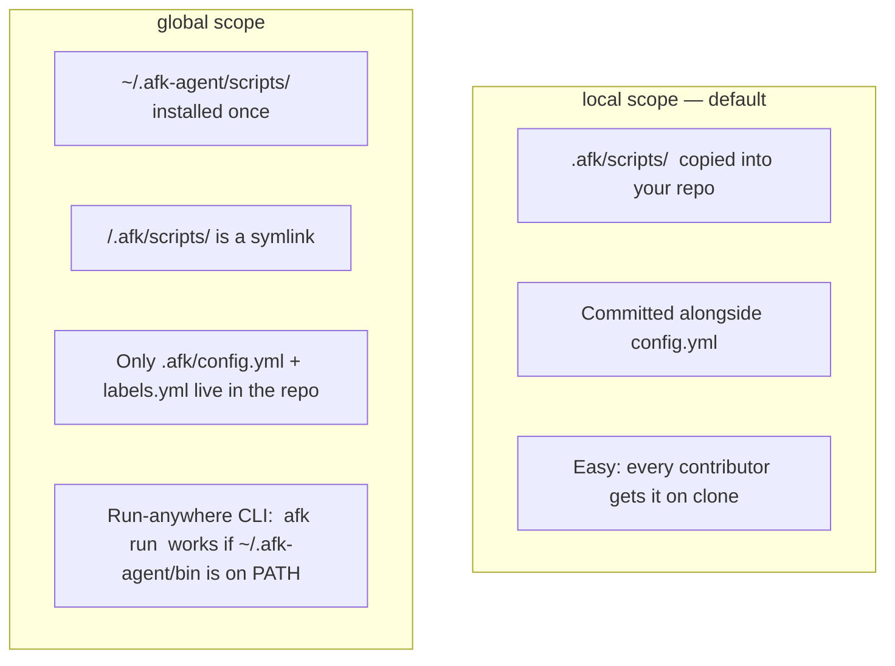

# Installation

> Looking for the **complete walkthrough**? Start at
> [docs/WORKFLOW.md](./WORKFLOW.md). This file is the install-only
> reference. For the chat-vs-terminal decision, see
> [docs/MODES.md](./MODES.md). For unfamiliar terms, see
> [docs/GLOSSARY.md](./GLOSSARY.md).

Two pieces install separately, on purpose:

1. **The skills** — `afk-grill`, `afk-prd`, `afk-setup`, `afk-run`,
   plus the six internal skills the orchestrator references. Installed
   once per machine via [skills.sh](https://www.skills.sh/) or per project.
2. **The orchestrator scaffold** (`.afk/` directory) — installed once
   per repo by the `/afk-setup` skill or `./install.sh`.

```mermaid
flowchart LR
  subgraph Once["Once per machine"]
    A[npx skills add &lt;repo&gt;]
    A --> B[afk-* skills available<br/>in every IDE agent session]
  end
  subgraph PerRepo["Once per repo"]
    C[/afk-setup<br/>(or ./install.sh)/]
    C --> D[.afk/ scaffolded<br/>with config.yml, prompts,<br/>scripts, templates]
    D --> E[.afk/scripts/afk setup<br/>creates tracker labels]
  end
  subgraph PerPRD["Per PRD"]
    F[/afk-grill/]
    G[/afk-prd/]
    H[.afk/scripts/afk decompose N]
    I[.afk/scripts/afk run]
    F --> G --> H --> I
  end
  B -.-> C
  E -.-> F
```

## 1. Install the skills

### Via `npx skills add` (recommended)

```bash
npx skills add Mo-Tamim/afk-agent
```

This auto-detects your agent runtime (Cursor, Claude Code, Codex,
Copilot, Windsurf, Gemini, Cline, …) and writes the skills to the
correct location. See the [skills.sh docs](https://www.skills.sh/docs)
for the per-agent paths.

### Manual install (any agent)

Clone the repo and symlink the `skills/` directory under whichever
location your agent reads:

| Agent / runtime  | Skill location (global)                              |
|------------------|------------------------------------------------------|
| Cursor           | `~/.cursor/skills/` or `~/.cursor/plugins/.../skills/` |
| Claude Code      | `~/.claude/skills/`                                  |
| Codex            | `~/.codex/skills/`                                   |
| GitHub Copilot   | `.github/copilot-instructions.md` references         |
| Generic AGENTS.md| Drop the snippet into your `AGENTS.md`              |

For project-local install, put the skills under `<repo>/.cursor/skills/`,
`<repo>/.claude/skills/`, etc.

> The `afk-setup` skill, when it scaffolds the orchestrator, **also
> copies the skills into `.afk/skills/`** so the bash scripts and the
> agent see the same skill text even if someone wipes their global
> install or works from a fresh container.

## 2. Scaffold the orchestrator

From inside your project:

### Option A: interactive, via the agent

In your IDE agent, type:

```
/afk-setup
```

The skill walks through three decisions (tracker, agent runner, merge
mode), shows you the resolved config, and runs `install.sh` for you.
This is the most beginner-friendly path.

### Option B: interactive, via shell

```bash
./install.sh
```

You'll be prompted for:

- **Tracker** — `github` or `gitlab`
- **Repo slug** — `<owner>/<repo>` (auto-detected from `origin`)
- **Default branch** — auto-detected from `origin/HEAD`
- **Agent runner binary** — `cursor-agent` / `claude` / `codex` /
  `gh copilot` / `gemini` / …
- **Merge mode** — `auto` or `gated`
- **Scope** — `local` (one repo) or `global` (shared across repos)

### Option C: non-interactive (CI / Docker / dotfiles)

```bash
./install.sh \
  --tracker github \
  --repo acme/widget \
  --default-branch main \
  --runner cursor-agent \
  --merge-mode auto \
  --scope local \
  --target /path/to/repo
```

Add `--no-rules-edit` to skip patching `AGENTS.md`. Add `--force` to
overwrite an existing `.afk/` without prompting.

## 3. Local vs. global scope



Pick **local** if:

- The repo's contributors want one-command setup (clone → use).
- You want each repo to pin the orchestrator version it was tested
  with.

Pick **global** if:

- You run AFK across many repos and want updates to flow with a single
  `git pull` of `afk-agent`.
- You don't want the orchestrator scripts checked into every repo.

Either way, **`config.yml` is per-repo.** The tracker, repo slug, and
runner choice belong to the project.

## 4. Tracker authentication

The orchestrator shells out to `gh` (GitHub) or `glab` (GitLab). Both
need an authenticated session before `.afk/scripts/afk setup` will
succeed.

```bash
# GitHub
gh auth login
gh auth status

# GitLab (gitlab.com)
glab auth login
glab auth status

# GitLab (self-hosted)
glab auth login --hostname gitlab.example.com
```

Both CLIs read repo slugs in the form `<owner>/<repo>`; self-hosted
GitLab uses the same slug syntax.

## 5. Verify the install

```bash
# Should print all your AFK labels with their colors.
.afk/scripts/afk setup

# Should print "(no state files)" until your first run.
.afk/scripts/afk status

# Should print the help banner.
.afk/scripts/afk help
```

If any of those fail, see [docs/EXTENDING.md](./EXTENDING.md)'s
troubleshooting section.

## 6. Per-agent quirks

### Cursor

The `cursor-agent` CLI ships with Cursor. Run
`cursor-agent --version` to confirm it's on `$PATH`. The orchestrator
calls it with `--print --force` so the agent does not prompt for
permission mid-run.

### Claude Code

Use `--runner claude`. The orchestrator passes the rendered prompt on
stdin and reads the agent's output line-by-line for the sentinel; no
extra flags needed beyond your `claude` defaults.

### Codex CLI

Use `--runner codex`. Same prompt-on-stdin contract.

### GitHub Copilot CLI

Use `--runner "gh copilot"`. Note the quoted argument — the runner is
two tokens.

### Custom runner

Anything that takes a prompt on stdin and prints to stdout works. Set
`agent_bin:` in `.afk/config.yml` to the binary, and `agent_flags:` to
whatever flags it needs. Test with:

```bash
echo "Say hello." | <your-runner> <your-flags>
```

If you can see "Hello" on stdout, the orchestrator can drive it.

## 7. Choosing chat-window vs terminal

After installing, you have four ways to run AFK. They all share state
on disk, so you can mix and match freely:

- **Chat-inline** — invoke `/afk-run …` in your IDE chat; everything
  streams back to chat.
- **Chat-detached** — `/afk-run` spawns the orchestrator into the
  background so chat closing doesn't kill it.
- **Terminal-foreground** — `.afk/scripts/afk issue N` or
  `.afk/scripts/afk run --once` in a shell.
- **Terminal-background** —
  `setsid nohup .afk/scripts/afk run > .afk/logs/orchestrator.log 2>&1 &`
  for truly unattended overnight runs.

The decision tree, pros/cons, and per-IDE notes live in
[docs/MODES.md](./MODES.md).
