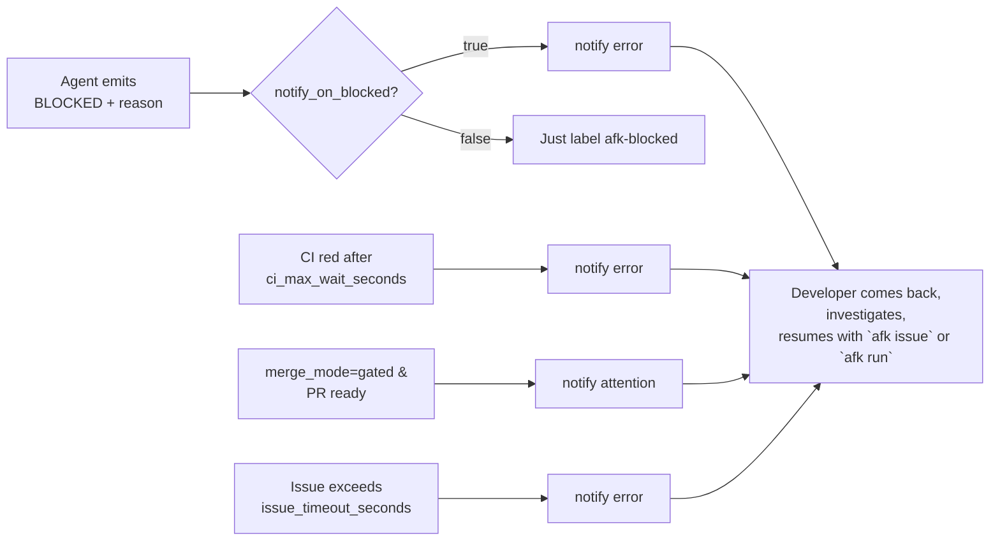

# Phase lifecycle

Every PRD walks the same lifecycle. Every child issue walks a sub-lifecycle
inside it.

## The whole picture

```mermaid
flowchart TD
  start([Developer commits PRD issue to tracker<br/>labels: afk-prd, ready-for-agent]) --> dec
  dec[decompose phase<br/>PRD → N vertical-slice children]
  dec --> q{For each child<br/>(orchestrator pool,<br/>max_parallel)}
  q --> plan[plan]
  plan --> impl[implement]
  impl --> rev[review]
  rev --> pr[pr]
  pr --> ci[pr_wait_ci]
  ci --> prrev[pr_review]
  prrev --> merge[pr_merge]
  merge --> q
  q -->|last child closed| doc[document phase]
  doc --> docpr[pr (docs)]
  docpr --> docmerge[pr_merge (docs)]
  docmerge --> done([PRD closed<br/>label: afk-done])

  plan -.BLOCKED.-> notify((notify-developer))
  impl -.BLOCKED.-> notify
  rev  -.BLOCKED.-> notify
  pr   -.BLOCKED.-> notify
  ci   -.RED or timeout.-> notify
  merge -.BLOCKED.-> notify
  doc  -.BLOCKED.-> notify
```

## Phase reference

| Phase           | Agent prompt                          | Sentinel(s) emitted                          | Persisted artifacts                  |
|-----------------|---------------------------------------|----------------------------------------------|--------------------------------------|
| `decompose`     | `prompts/decompose-prompt.md`         | `<children>[…]</children>` + COMPLETE; BLOCKED | `logs/.../children.json` parsed by `decompose.sh` |
| `plan`          | `prompts/plan-prompt.md`              | `<plan>{…}</plan>` + COMPLETE; BLOCKED       | `logs/.../plan.json` → `state.branch`, `state.package` |
| `implement`     | `prompts/implement-prompt.md`         | COMPLETE; NO_CHANGES; BLOCKED                | git commits on `<branch>`            |
| `review`        | `prompts/review-prompt.md`            | COMPLETE; NO_CHANGES; BLOCKED                | git commits on `<branch>`            |
| `pr`            | `prompts/pr-prompt.md`                | `<pr>{…}</pr>` + COMPLETE; BLOCKED           | `logs/.../pr.json` → `state.pr`      |
| `pr_wait_ci`    | (no agent — orchestrator polls)       | n/a                                          | none                                 |
| `pr_review`     | `prompts/pr-review-prompt.md`         | COMPLETE; NO_CHANGES; BLOCKED                | tracker review comment / approval    |
| `pr_merge`      | `prompts/merge-prompt.md`             | COMPLETE; BLOCKED                            | squash-merge on tracker              |
| `document`      | `prompts/document-prompt.md`          | COMPLETE; BLOCKED                            | git commits on `afk/docs-prd-<N>-<slug>` |

### Sentinels in detail

```mermaid
graph TD
  classDef good fill:#dfd,stroke:#166534,color:#0f172a,stroke-width:1.5px;
  classDef neut fill:#ffd,stroke:#92400e,color:#0f172a,stroke-width:1.5px;
  classDef bad  fill:#fdd,stroke:#991b1b,color:#0f172a,stroke-width:1.5px;

  A[Agent finishes phase] --> B{Last sentinel?}
  B -->|COMPLETE| good[Record completed_phase<br/>Advance to next phase]:::good
  B -->|NO_CHANGES| neut[Record history note<br/>Advance to next phase<br/>except 'implement' which bails]:::neut
  B -->|BLOCKED| bad[Label issue afk-blocked<br/>Record reason<br/>Trigger notify-developer]:::bad
  B -->|(none)| crash[Treat as crash<br/>Trigger notify-developer<br/>Operator decides]:::bad
```

`NO_CHANGES` from `implement` is a graceful bail — the implementer
detected nothing to do (e.g. the work already landed in a prior
commit). The orchestrator stops here and does not open an empty PR.

## Telemetry events

Each lifecycle transition appends one JSON line to
`.afk/logs/events.ndjson`. The dashboard reads this stream; downstream
analytics can too.

```mermaid
flowchart TB
  orch_start([orchestrator_start]) --> spawn[runner_spawn]
  spawn --> issue_start[issue_start]
  issue_start --> phase_loop{for each phase}
  phase_loop --> phase_start[phase_start]
  phase_start --> agent[agent_spawn]
  agent --> phase_end[phase_end<br/>outcome=COMPLETE / NO_CHANGES / BLOCKED<br/>+ duration_s + rc]
  phase_end --> phase_loop
  phase_loop -->|done| issue_end[issue_end<br/>rc=…]
  issue_end --> reap[runner_reap<br/>rc=…]
  reap -->|more queued?| spawn
  reap -->|empty| orch_exit([orchestrator_exit<br/>reason=normal | trap])
```

| `kind`              | emitted by         | key fields                                          |
| ------------------- | ------------------ | --------------------------------------------------- |
| `orchestrator_start`| `orchestrate.sh`   | `max_parallel`, `tracker`, `repo`                   |
| `orchestrator_exit` | `orchestrate.sh`   | `reason` (`normal` or `trap`)                       |
| `runner_spawn`      | `orchestrate.sh`   | `issue`, `runner_pid`                               |
| `runner_reap`       | `orchestrate.sh`   | `issue`, `runner_pid`, `rc`                         |
| `issue_start`       | `run-issue.sh`     | `issue`                                             |
| `issue_end`         | `run-issue.sh`     | `issue`, `rc`                                       |
| `phase_start`       | `run-phase.sh`     | `issue`, `phase`, `branch`, `cwd`, `log`, `run_id`  |
| `agent_spawn`       | `run-phase.sh`     | `issue`, `phase`, `agent_pid`, `agent_bin`          |
| `phase_end`         | `run-phase.sh`     | `issue`, `phase`, `outcome`, `rc`, `duration_s`, `log`, `run_id` |

Reserved auto-injected fields: `ts` (ISO 8601), `ts_epoch` (float),
`kind`, `scope`, `pid`. See [DASHBOARD.md](./DASHBOARD.md) for the
consumer-side `/api/events` endpoint.

## Daily commands

```bash
# One-time per repo
.afk/scripts/afk setup

# Run after /afk-prd has opened a PRD on your tracker
.afk/scripts/afk decompose <PRD#>     # PRD → children

# Background orchestrator (Ctrl-C is safe; resume is automatic)
.afk/scripts/afk run

# Or drive one issue end-to-end (great for debugging the harness)
.afk/scripts/afk issue <child#>

# Manually trigger the docs phase for a PRD whose children are all closed
.afk/scripts/afk document

# Snapshot of in-flight state
.afk/scripts/afk status

# Live web dashboard at http://127.0.0.1:8765 (read-only)
.afk/scripts/afk dashboard --background
.afk/scripts/afk dashboard --stop

# Silence any active wake-up alarm
.afk/scripts/afk stop-notify
```

## Escape hatches

When something cannot be done by an agent, the orchestrator escalates via
[`notify-developer`](https://www.skills.sh/) (or any compatible audible
alarm script under `~/.cursor`, `~/.claude`, or `~/.agents`). Common
escalations:



The alarm stops automatically at the start of the next agent turn (per
the `notify-developer` contract), so the developer never has to
manually silence it.
