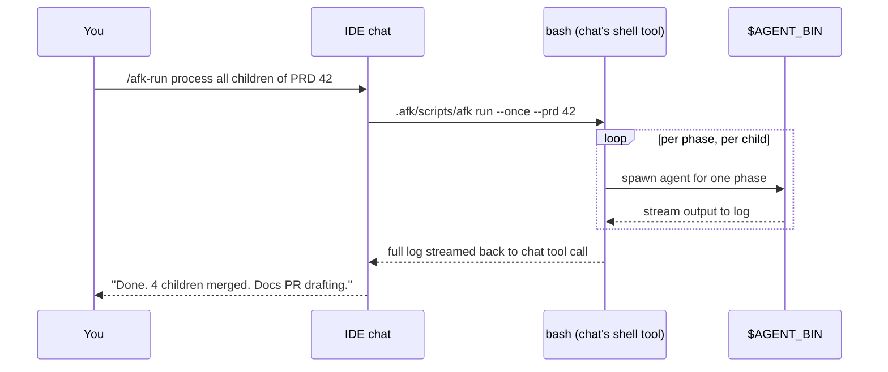
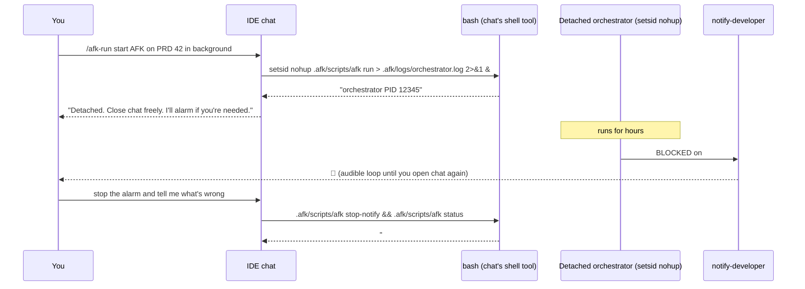
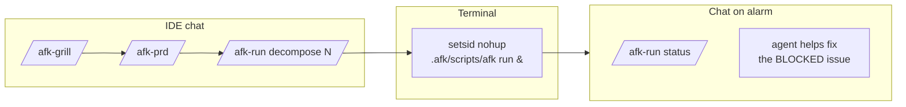

# Run modes — chat, terminal, hybrid

`afk-agent` runs in three modes. They all do the same work; they
differ only in **where the orchestrator process lives** and **how
you see its output**.

## Decision tree

```mermaid
flowchart TD
  Start[I want to run AFK] --> Q1{Where do I usually live?}
  Q1 -->|IDE chat<br/>Cursor / Copilot / Claude| Q2{How big is the PRD?}
  Q1 -->|Terminal| Q3{How big is the PRD?}
  Q1 -->|"Both — I open chat for design,<br/>terminal for long runs"| Hybrid[Use hybrid mode]

  Q2 -->|1 child or small PRD<br/>(≤3 children)| ChatInline[Chat-inline mode<br/>/afk-run … inside chat]
  Q2 -->|big PRD<br/>(4+ children)| ChatDetach[Chat-detached mode<br/>agent spawns 'afk run' in background]

  Q3 -->|1 child or small PRD| TermInline[Terminal-foreground<br/>afk issue N or afk run --once]
  Q3 -->|big PRD| TermBg[Terminal-background<br/>setsid nohup afk run &]

  ChatInline & ChatDetach & Hybrid & TermInline & TermBg --> Same[Same orchestrator,<br/>same state files,<br/>same PR outcomes]
```

## Mode 1 — Chat-inline (the default chat experience)

You stay in the IDE agent chat for everything.



**Pros:**
- No context switch. You see every log line.
- Easy to ask follow-up questions ("retry #46 with more verbose
  logging") because the agent has full context.

**Cons:**
- Tool calls have time limits in some agents (~30 min). A 5-child
  PRD might exceed it; consider chat-detached for those.
- Closing chat ends the tool call. The orchestrator's state is
  saved, but the run is interrupted.

**When to use:** 1–3 children, you want to watch.

**Cancel:** close the tool call (most agents have a stop button).
The orchestrator's per-issue lock files clean up when the parent
process exits; if any are stale, see
[EXTENDING.md § troubleshooting](./EXTENDING.md#troubleshooting).

## Mode 2 — Chat-detached

You start the orchestrator from chat but spawn it detached so it
survives chat ending.



**Pros:**
- Truly AFK. You can close the laptop.
- Orchestrator keeps running across chat sessions, OS sleeps, agent
  restarts.

**Cons:**
- The agent loses real-time visibility. You only know what
  `afk status`, `afk dashboard`, or
  `tail .afk/logs/orchestrator.log` tell you.
- Requires `notify-developer` (or compatible) for sound — without
  it, you have to remember to check in.

**When to use:** 4+ children, long-running PRDs, overnight runs.

**Watch live (optional):** spawn the read-only dashboard alongside,
then open the URL in your browser:

```bash
.afk/scripts/afk dashboard --background
# → http://127.0.0.1:8765 (no auth; bound to loopback)
```

Stop it with `.afk/scripts/afk dashboard --stop`. See
[DASHBOARD.md](./DASHBOARD.md).

**Cancel:**

```bash
pkill -f orchestrate.sh
```

## Mode 3 — Terminal-foreground

You stay in a shell.

```bash
# Drive one child end-to-end (blocking, 5–30 min)
.afk/scripts/afk issue 43

# Drain the queue once and exit (blocking)
.afk/scripts/afk run --once
.afk/scripts/afk run --once --prd 42
```

**Pros:**
- No agent overhead. Pure bash + your `$AGENT_BIN`.
- Easiest to integrate with CI: `afk run --once` returns a useful
  exit code.

**Cons:**
- Manual. You have to know which subcommand you want.

**When to use:** CI, scripting, debugging the orchestrator itself.

## Mode 4 — Terminal-background

You spawn the orchestrator detached from a terminal.

```bash
# Start
setsid nohup .afk/scripts/afk run > .afk/logs/orchestrator.log 2>&1 < /dev/null &
echo "orchestrator PID $!"

# Watch
tail -f .afk/logs/orchestrator.log

# Snapshot
.afk/scripts/afk status

# Stop
pkill -f orchestrate.sh
```

**Pros:**
- Standard Unix backgrounding. Survives the terminal closing.

**Cons:**
- No automatic wake-up unless you have `notify-developer`.

**When to use:** servers, long overnight runs, any time you want
`afk run` to outlive your shell.

## Mode 5 — Hybrid (recommended once you're comfortable)

Use chat for the **design** phases and terminal for the **run**
phase.



This is what most users settle on after a couple of PRDs.
Chat is best for thinking; terminal is best for waiting.

## Per-IDE notes

### Cursor

Both `cursor-agent` (CLI) and the chat sidebar work. The chat has a
shell tool you can use for `/afk-run`. The CLI is what the
orchestrator spawns per phase regardless of where you launched it.

### Claude Code

`claude` in your terminal runs as both your agent and the
orchestrator's per-phase agent (via `agent_bin: claude` in
`config.yml`). Works identically in either mode.

### GitHub Copilot Chat (VS Code / Visual Studio)

The chat panel has a shell tool but with stricter time limits. Use
chat-inline for small PRDs; for big ones, ask Copilot Chat to start
the detached orchestrator and then close the chat.

### Windsurf / Cline / Gemini / Codex

Same shape. If the agent has a shell tool, all four modes work. If
not, fall back to terminal-only.

## Quick reference: which command for which mode

| Mode               | Command                                                                                |
|--------------------|----------------------------------------------------------------------------------------|
| Chat-inline        | `/afk-run process queue` (agent translates to `afk run --once`)                       |
| Chat-detached      | `/afk-run start AFK in background` (agent spawns `setsid nohup afk run &`)            |
| Terminal-foreground| `.afk/scripts/afk issue N` OR `.afk/scripts/afk run --once`                            |
| Terminal-background| `setsid nohup .afk/scripts/afk run > .afk/logs/orchestrator.log 2>&1 &`               |
| Hybrid             | chat for steps 4–6, terminal-background for step 7, chat again for step 9            |
| Dashboard (any)    | `.afk/scripts/afk dashboard --background` → `http://127.0.0.1:8765`                  |
