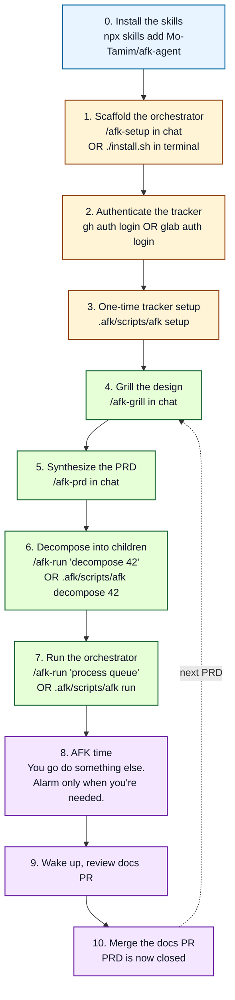
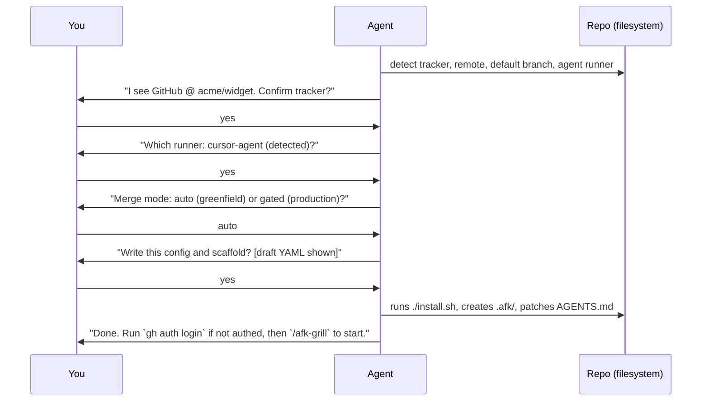
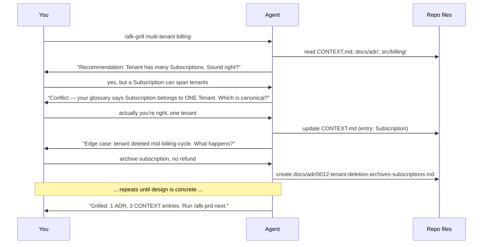
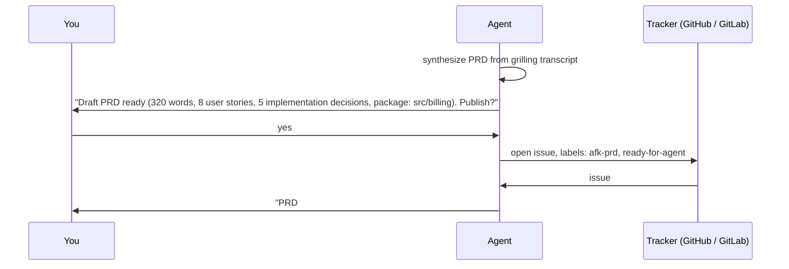
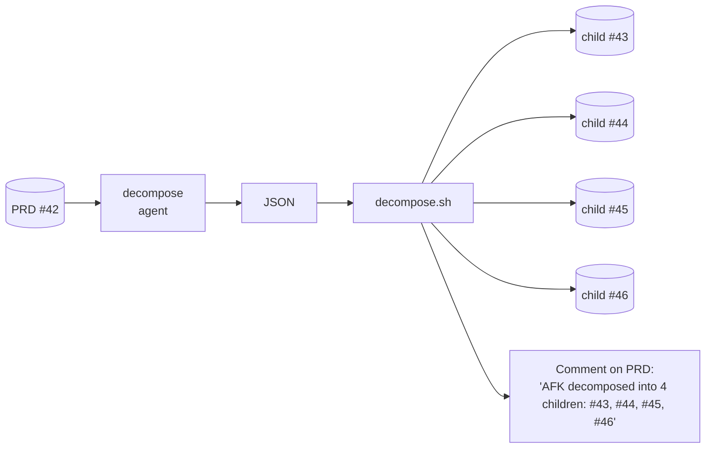
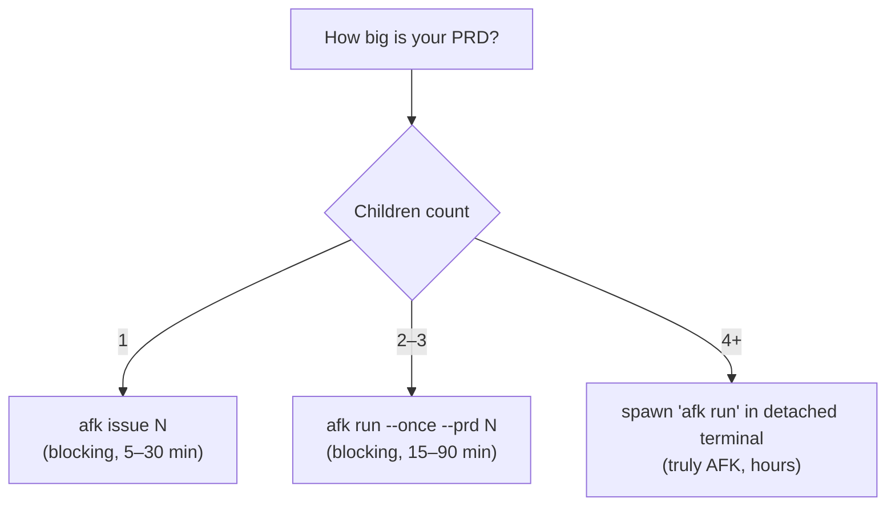
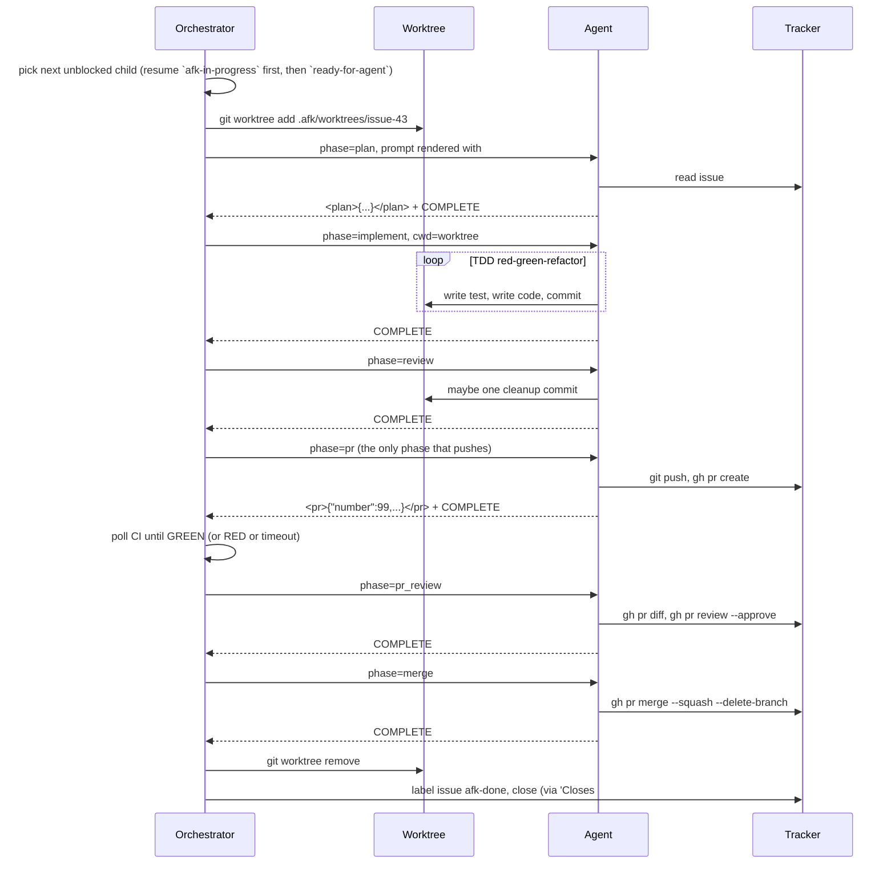
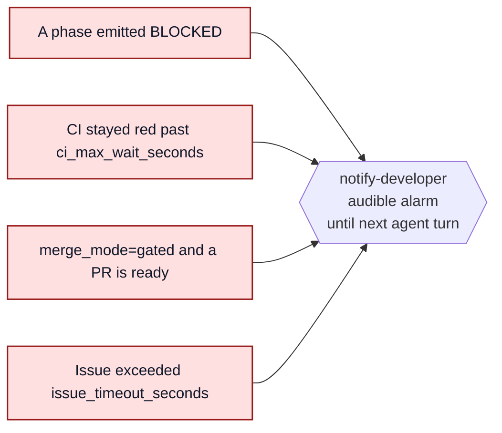
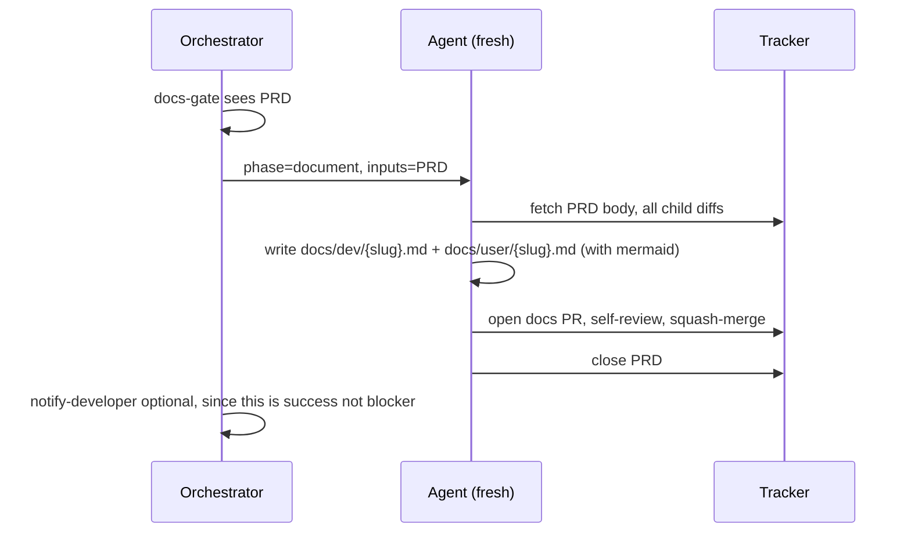

# User workflow — from zero to merged PRD

This is the friendliest, longest, most hand-holding document in the
repo. Read it front-to-back the first time you use `afk-agent`. After
that, [`docs/LIFECYCLE.md`](./LIFECYCLE.md) is the quick reference.

If a word here is new to you, check the [glossary](./GLOSSARY.md).

> **Two ways to do everything.** Every step below shows both:
> the **chat** way (typed inside your IDE agent — Cursor, Claude
> Code, Copilot Chat, …) and the **terminal** way (typed in a shell).
> Pick whichever feels natural; you can mix and match.

---

## The whole journey at a glance



Steps 0–3 are **once per machine / once per repo**. Steps 4–10 happen
**once per PRD** (sometimes several PRDs in parallel).

---

## Step 0 — Install the skills (once per machine)

### What it is

Pulls the eleven `afk-*` skills into your agent's skills directory so
they show up in autocomplete (`/afk-...`) and the agent loads them
on demand.

### Do it

**Terminal:**

```bash
npx skills add Mo-Tamim/afk-agent
```

**What you see:** a one-line confirmation per skill, ending with
something like `installed 11 skills to ~/.cursor/skills/afk-agent/`.

> Don't have `npx skills` and don't want it? See
> [INSTALLATION.md § Manual install](./INSTALLATION.md#manual-install-any-agent).

### Verify

Type `/afk-` in your IDE chat. You should see autocomplete for
`afk-grill`, `afk-prd`, `afk-setup`, `afk-run`, etc.

---

## Step 1 — Scaffold the orchestrator (once per repo)

### What it is

Drops a `.afk/` directory into your project containing the bash
orchestrator, the eight phase prompts, the templates, and a copy
of the skills. Patches your `AGENTS.md` (or `CLAUDE.md`,
`.cursorrules`, etc.) so future agent sessions know AFK is active.

### Do it

**Chat:**

```
/afk-setup
```

The agent reads your repo, proposes a config, asks you three
questions one at a time:



**Terminal:**

```bash
./install.sh                     # interactive prompts
# or:
./install.sh --tracker github --repo acme/widget \
             --runner cursor-agent --merge-mode auto
```

### What you see when it finishes

```
✔ AFK orchestrator scaffolded into: /path/to/repo/.afk
  tracker:        github (acme/widget)
  default branch: main
  agent runner:   cursor-agent
  merge mode:     auto
  scope:          local

Next steps:
  1. Authenticate the tracker CLI: gh auth login
  2. .afk/scripts/afk setup
  3. /afk-grill <design idea>
```

### What changed in your repo

```
your-repo/
├── AGENTS.md             ← appended: "## AFK orchestrator" section
└── .afk/                 ← NEW
    ├── config.yml        ← your choices, ready to edit
    ├── labels.yml
    ├── .gitignore        ← ignores state/, worktrees/, logs/
    ├── prompts/          ← 8 phase prompts (committed)
    ├── templates/        ← issue / PR / docs templates (committed)
    ├── skills/           ← copy of skills (committed)
    └── scripts/          ← orchestrator (committed)
```

`state/`, `worktrees/`, `logs/` will appear as soon as the
orchestrator runs; they're gitignored so they don't pollute your
diff history.

---

## Step 2 — Authenticate the tracker (once per machine)

### What it is

`gh` (GitHub) and `glab` (GitLab) need an authenticated session
before any tracker call works.

### Do it

**Terminal:**

```bash
# GitHub
gh auth login                # follow the device-flow prompts

# GitLab.com
glab auth login

# GitLab self-hosted (e.g. Nokia GitLab)
glab auth login --hostname gitlabe2.ext.net.nokia.com
```

> The chat agent can't do device-flow auth for you — this one is a
> terminal step. After it's done, you never have to do it again on
> this machine.

### Verify

```bash
gh   auth status   # → "Logged in to github.com as Mo-Tamim"
glab auth status   # → "Logged in to gitlab.com" (or your host)
```

---

## Step 3 — Create the AFK labels (once per repo)

### What it is

Creates the seven labels the orchestrator uses (`afk-prd`,
`afk-child`, `ready-for-agent`, `afk-in-progress`, `afk-blocked`,
`needs-human`, `afk-done`, `afk-docs`) on the tracker.

### Do it

**Chat (via /afk-run):**

```
/afk-run setup
```

**Terminal:**

```bash
.afk/scripts/afk setup
```

### What you see

```
[INFO ] [setup] tracker = github (gh)
[INFO ] [setup] target repo: acme/widget
[INFO ] [setup] ensuring labels…
[INFO ] [setup] label 'ready-for-agent' created
[INFO ] [setup] label 'afk-in-progress' created
... (8 lines total)
[INFO ] [setup] setup complete.
```

Idempotent — safe to run again if you change `labels.yml`.

---

## Step 4 — Grill the design (start of every PRD)

### What it is

A guided, interruption-friendly interview where the agent challenges
your design idea against the existing codebase and your own glossary.
**Outputs are not the conversation** — they are:

- New / updated entries in `CONTEXT.md` (your domain glossary).
- One or more new ADRs under `docs/adr/` (if any decision deserves a
  paper trail).

### Do it

**Chat:**

```
/afk-grill I want to add multi-tenant billing
```

The agent goes into interview mode — one question at a time — until
the design is concrete enough that it can be expressed in modules,
acceptance criteria, and trade-offs.



### What you'll do

Answer questions in your own words. If you don't know an answer,
say so — the agent will either explore the code or BLOCK and ask
you to make a call.

### What you'll see in the repo

```diff
+ docs/adr/0012-tenant-deletion-archives-subscriptions.md
~ CONTEXT.md   (3 new entries: Tenant, Subscription, BillingAccount)
```

Commit these manually before the next step:

```bash
git add CONTEXT.md docs/adr/0012-*.md
git commit -m "Domain: tenant + subscription model from /afk-grill"
```

### How long it takes

5–30 minutes of back-and-forth. The agent waits for you between
questions, so you can answer at your own pace.

---

## Step 5 — Synthesize the PRD (every PRD)

### What it is

The agent reads the grilling transcript, writes a PRD using the
template in `skills/afk-prd/SKILL.md`, and opens it as an issue on
your tracker with the right labels.

### Do it

**Chat:**

```
/afk-prd
```

(no arguments — the agent uses the conversation context from
`/afk-grill`).

### What you'll see



### What the PRD contains

A 7-section issue body:

```
## Problem statement
## Solution
## User stories
## Implementation decisions
## Testing decisions
## Out of scope
## Further notes
## Package path
```

Take 60 seconds to skim it on the tracker. If something is wrong,
**edit the issue body directly** — the decomposer reads the issue,
not the chat transcript.

---

## Step 6 — Decompose the PRD into children (every PRD)

### What it is

The agent reads PRD #42 and emits a JSON array of vertical-slice
child issues. The bash runner creates them on the tracker in
dependency order, resolving `Blocked by` references as it goes.

### Do it

**Chat:**

```
/afk-run decompose 42
```

**Terminal:**

```bash
.afk/scripts/afk decompose 42
```

### What you see (~1–3 minutes)

```
[INFO ] [decompose:#42] PRD #42 → decomposing under package: src/billing
[INFO ] [phase:decompose:#42] spawning cursor-agent in /path/to/repo
... agent works for 60–180 seconds ...
[INFO ] [phase:decompose:#42] phase decompose → COMPLETE
[INFO ] [decompose:#42] created child #43: src/billing: add Tenant aggregate root
[INFO ] [decompose:#42] created child #44: src/billing: add Subscription model
[INFO ] [decompose:#42] created child #45: src/billing: wire BillingService bootstrap
[INFO ] [decompose:#42] created child #46: src/billing: add invoice-on-cycle webhook
[INFO ] [decompose:#42] decomposition done: 43 44 45 46
```



### How many children to expect

Typically **3–8 per PRD**. If you see > 12, the PRD was too big —
consider splitting it into multiple PRDs.

If you see < 2, the PRD was probably already a child-sized task —
delete the children, change the PRD's label from `afk-prd` to
`ready-for-agent`, and skip straight to step 7.

---

## Step 7 — Run the orchestrator (every PRD)

This is where AFK earns its name.

### Pick a mode



See [docs/MODES.md](./MODES.md) for the full mode reference,
including how to detach from chat.

### Do it (small PRD, inline)

**Chat:**

```
/afk-run process all children of PRD 42
```

**Terminal:**

```bash
.afk/scripts/afk run --once --prd 42
```

### Do it (large PRD, background)

**Chat:** the agent spawns it for you via the `afk-run` skill.

**Terminal:**

```bash
setsid nohup .afk/scripts/afk run > .afk/logs/orchestrator.log 2>&1 < /dev/null &
echo "orchestrator PID $!"
tail -f .afk/logs/orchestrator.log     # Ctrl-C just stops the tail
```

To stop the orchestrator:

```bash
pkill -f orchestrate.sh
```

### What happens per child (recap)



Per child: roughly **5–25 minutes** wall-clock, depending on test
runtime and CI.

For a PRD with 4 children at `max_parallel: 3`, expect total wall
time of about **(4/3) × per-child** ≈ 10–40 minutes.

---

## Step 8 — Go AFK

Close your laptop. Make coffee. Go for a walk.

> **Watch progress in a browser (optional).** If you'd rather see
> the run live than wait for an alarm, launch the dashboard:
>
> ```bash
> .afk/scripts/afk dashboard --background   # detached on http://127.0.0.1:8765
> ```
>
> The dashboard auto-refreshes every 2 s and shows orchestrator
> liveness, per-issue phase pipelines, log tails, worktrees, PRs,
> CI, and a **subprocess registry** tail (spawn/reap audit for runners,
> agent wrappers, and timeout sentries). It's read-only and safe to
> leave open. See [docs/DASHBOARD.md](./DASHBOARD.md).

The orchestrator will:

- Keep up to `max_parallel` children flowing.
- Auto-rebase children onto fresh `origin/main` as siblings merge.
- Poll CI; mark `afk-blocked` if it goes red.
- Self-review every PR via a fresh agent (no context-bleed bias).
- Squash-merge each PR when green and approved.
- Trigger the `document` phase as soon as the last child closes.
- Emit one JSON line per lifecycle event to
  `.afk/logs/events.ndjson`, which the dashboard consumes.

The orchestrator will **wake you up** only when:



The alarm is the [`notify-developer`](https://www.skills.sh/)
skill — install it once if you want sound; the orchestrator no-ops
if it isn't found.

---

## Step 9 — Wake up and inspect

When the orchestrator wants you, you'll hear the alarm or see the
notification. To see what's going on, in **one command**:

**Chat:**

```
/afk-run status
```

**Terminal:**

```bash
.afk/scripts/afk status
```

### What you see

```
#43 [done]      done=plan,implement,review,pr,pr_review,merge | branch=afk/issue-43-add-tenant      | pr=99  | updated=2026-06-08T03:12:00Z
#44 [done]      done=plan,implement,review,pr,pr_review,merge | branch=afk/issue-44-add-subscription | pr=100 | updated=2026-06-08T03:18:00Z
#45 [running]   done=plan,implement,review,pr                 | branch=afk/issue-45-billing-bootstrap| pr=101 | updated=2026-06-08T03:21:00Z
#46 [blocked]   done=plan,implement                           | branch=afk/issue-46-invoice-webhook  | pr=—   | updated=2026-06-08T03:20:00Z
```

Then `cat` the most recent log for the blocked one:

```bash
cat .afk/logs/issue-46-implement-latest/implement.log | tail -50
```

The last few lines have the BLOCKED reason.

### Fix and resume

After fixing whatever was wrong (e.g. you authored a missing
helper, clarified the PRD, updated an ADR):

```bash
# Clear the block label
gh issue edit 46 --remove-label afk-blocked --add-label ready-for-agent

# Drop the lock file from the dead runner
rm -f .afk/state/issue-46.lock

# Drive that one issue again
.afk/scripts/afk issue 46
```

The resume model picks up at the first not-completed phase.

---

## Step 10 — Review and merge the docs PR

Once the last child of a PRD closes, the orchestrator runs the
`document` phase:



You'll find two new markdown files in `<package-path>/docs/`:

- `docs/dev/<prd-slug>.md` — for future contributors (architecture
  diagram, module reference, extension points, test strategy,
  gotchas).
- `docs/user/<prd-slug>.md` — for end users (workflow diagram,
  step-by-step, troubleshooting).

Skim both, then move on to the next PRD or take the rest of the day.

The docs-gate is crash-safe the same way per-child runs are. When it
starts a PRD's docs phase it stamps the PRD `afk-in-progress` **and**
takes a per-PRD lock (`.afk/state/issue-<PRD>.lock`) recording its pid.
If the runner dies mid-docs (e.g. cursor-agent loses its connection, or
you kill the orchestrator), the label and lock are left behind. On the
next pass the gate probes the lock for liveness:

- lock owned by a **running** pid → a docs runner is genuinely active →
  skip (no double-processing).
- lock missing or pid **dead** → stale → **resume** the interrupted
  docs run from the first not-completed phase
  (`document` → `pr` → `merge`, tracked in `.afk/state/issue-<PRD>.json`),
  reusing the existing branch/worktree/PR.

This is why a stale `afk-in-progress` no longer wedges a PRD forever —
the gate distinguishes "still running" from "crashed and left a label"
instead of treating every `afk-in-progress` PRD as busy.

---

## Edge cases & gotchas

### "I changed my mind about a child issue mid-run"

Edit the issue body on the tracker. The next phase re-reads it
fresh. If the phase has already passed (e.g. `plan` is done), use
`afk::state_phase_clear_completed` to redo it
(see [EXTENDING.md § troubleshooting](./EXTENDING.md#troubleshooting)).

### "I found an error in an ADR or PRD after the fact (or changed my mind)"

A wrong ADR, a PRD that misstated the work, a misunderstanding baked in
when the ADR was written, and a plain change of mind are all the same
event — a recorded decision changed. Use the `/afk-amend` skill; it
routes the fix by lifecycle state:

- **ADR/CONTEXT only, no PRD yet** → write a superseding ADR, update
  `CONTEXT.md`, merge to the default branch.
- **PRD open, not decomposed** → fix the ADR on main, then edit the
  tracker issue body.
- **Decomposed, no child started** → fix the ADR on main, edit the PRD,
  close + recreate the affected children, re-decompose.
- **Children in flight** → fix the ADR on main, edit/close open
  children, add corrective children or a follow-up PRD; the orchestrator
  rebases in-flight children onto the fresh main.
- **PRD closed / shipped (`afk-done`)** → forward-only: superseding ADR
  plus a **new** corrective PRD. Never reopen an `afk-done` PRD.

The invariant in every branch: the corrected ADR/`CONTEXT.md` must be
**merged to the default branch first**. Every phase derives its worktree
from `origin/main`, so an ADR on an unmerged branch is invisible to every
agent and the rejected decision gets re-implemented.

### "I want to run two PRDs in parallel"

Just decompose both. `afk run` doesn't care which PRD a child
belongs to — it picks any unblocked `afk-child` issue that is either
**`afk-in-progress`** (resume band: e.g. after a crash or Ctrl-C left
the tracker in that state) or **`ready-for-agent`** (fresh work).
In-progress issues sort **ahead of** ready-only issues so a stalled
head-of-chain child is picked up automatically when you start
`afk run` again.

### "The orchestrator or IDE died mid-issue"

If the tracker still shows `afk-in-progress` on the child, the next
`afk run` **auto-resumes** that issue (same rules as `afk issue N`:
per-phase state in `.afk/state/issue-N.json` plus idempotent tracker
short-circuits). You do **not** have to re-add `ready-for-agent` just
because the runner stopped locally. If you truly abandoned the work,
remove the in-progress label or mark the issue blocked manually.

### "The docs phase died mid-run and the PRD is stuck"

Same story as a child issue, on the PRD. The docs-gate stamps the PRD
`afk-in-progress` and takes `.afk/state/issue-<PRD>.lock` before running
the `document` agent. If that run is killed (connection lost, you killed
the orchestrator) the label and lock stay behind. The next `afk run`
idle pass — or a manual `afk document` — checks whether the lock's pid is
still alive: if not, it treats the label as **stale** and resumes the
docs phase from the first not-completed step instead of skipping the PRD
forever. You don't need to hand-remove the label. If you truly want to
abandon the docs run, delete `.afk/state/issue-<PRD>.lock` and remove the
`afk-in-progress` label, or mark the PRD `afk-blocked`.

### "CI is flaky and the orchestrator keeps marking things blocked"

Bump `ci_max_wait_seconds` in `.afk/config.yml` and re-run the
blocked issues. If a specific test is flaky, fix the test in a
separate PRD before unleashing AFK on more children.

### "I want to pause the orchestrator without killing it"

Remove `ready-for-agent` from every open child issue:

```bash
for n in $(gh issue list --label afk-child --label ready-for-agent \
              --state open --json number --jq '.[].number'); do
  gh issue edit "$n" --remove-label ready-for-agent
done
```

The orchestrator will drain its in-flight runners and then idle.
Re-label to resume.

### "My repo isn't on GitHub or GitLab — can I still use this?"

Yes, but you'll need to add a new arm to `lib/tracker.sh` for
your tracker. See [EXTENDING.md § Add a new tracker](./EXTENDING.md#add-a-new-tracker).
A Forgejo / Gitea / Linear adapter is ~80 lines of bash.

---

## Cheat-sheet (print and pin)

```text
ONE-TIME (per machine)
  npx skills add Mo-Tamim/afk-agent      install skills
  gh   auth login                         authenticate GitHub
  glab auth login                         authenticate GitLab

ONE-TIME (per repo)
  /afk-setup                              scaffold .afk/
  .afk/scripts/afk setup                  create tracker labels

PER PRD
  /afk-grill <idea>                       stress-test design → ADRs
  /afk-prd                                synthesize PRD → tracker issue
  /afk-amend                              re-propagate a changed ADR/PRD decision
  /afk-run decompose <PRD#>               PRD → vertical-slice children
  /afk-run process queue                  inline orchestrator (small PRDs)
  .afk/scripts/afk run                    background orchestrator (big PRDs)
  /afk-run status                         what's in flight
  .afk/scripts/afk dashboard --background live web view (http://127.0.0.1:8765)

ON ALARM
  /afk-run status                         see what's blocked
  cat .afk/logs/issue-N-PHASE-latest/PHASE.log | tail -50
                                          read the BLOCKED reason
  (fix it)
  gh issue edit N --remove-label afk-blocked --add-label ready-for-agent
  rm -f .afk/state/issue-N.lock
  .afk/scripts/afk issue N                resume that one issue
```
