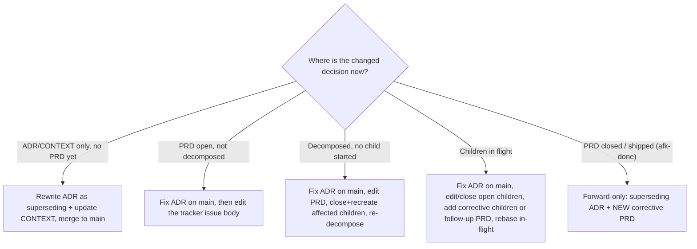

# Skill: afk-amend

All four triggers — a wrong ADR, a wrong PRD, a misunderstanding at the
time the ADR was written, or the designer changing their mind — are the
**same event**: *a recorded decision changed after it was written down*.

AFK is forward-only. There is no "rewind". The correct fix depends
entirely on **how far the decision has already travelled** through the
pipeline, so this skill first classifies the lifecycle state, then
propagates the change from there.

The one rule that holds in **every** branch:

> The corrected ADR / `CONTEXT.md` must land on the **default branch**
> before any `decompose`, `plan`, or `implement` agent runs again. Every
> phase derives its worktree from `origin/main`
> (see [`afk-workflow`](../afk-workflow/SKILL.md) branching rules), so an
> ADR sitting on an unmerged branch is **invisible** to every agent and
> the old, rejected decision gets re-implemented.

## The decision tree



## Step 1 — Classify the lifecycle state

Figure out which branch of the tree you are in. Read the tracker via
the [`afk-tracker-issue`](../afk-tracker-issue/SKILL.md) skill and the
repo:

- Is there an **ADR** in `docs/adr/` (or a context-local `docs/adr/`)
  for this decision? Is there a `CONTEXT.md` entry?
- Is there a **PRD issue** on the tracker? What labels does it carry —
  `afk-prd`, `ready-for-agent`, `afk-in-progress`, `afk-done`?
- Has it been **decomposed**? Look for `afk-child` issues whose
  `Parent:` / `PRD:` points at it.
- For each child: open or merged? `ready-for-agent`,
  `afk-in-progress`, or closed?

The combination places you in exactly one branch (A–E) below.

## Step 2 — Rewrite the decision (a focused re-grill)

Do **not** silently edit the old ADR's body to pretend the original
decision never happened — the paper trail is the point.

- If the change is a genuine design rethink, run a focused interview
  using [`afk-grill`](../afk-grill/SKILL.md) semantics on just the
  affected branch of the design — one question at a time, challenge
  against the existing glossary and code, stop when the new decision is
  concrete.
- Write a **new, superseding ADR** with the next number, using the ADR
  format from `afk-grill`. Its `## Status` records what it supersedes:

```markdown
# 13. Subscriptions belong to exactly one Tenant

## Status
Accepted on 2026-06-11. Supersedes ADR-0009.

## Context
ADR-0009 assumed a Subscription could span Tenants; billing
reconciliation proved that wrong. <2–4 sentences on what forced the
change now.>

## Decision
<one sentence: the corrected decision>

## Consequences
- Positive: ...
- Negative: ...
- Neutral: ...

## Alternatives considered
- <option>: why rejected
```

- Flip the **old** ADR's `## Status` to `Superseded by ADR-0013` (this
  is the only edit you make to the old ADR — a one-line status pointer,
  not a rewrite).
- If vocabulary shifted, update the relevant `CONTEXT.md` entry inline,
  exactly as `afk-grill` would.

## Step 3 — Land it on the default branch FIRST

This is the invariant. Before touching any tracker issue or running any
phase:

```bash
git add docs/adr/ CONTEXT.md
git commit -m "Amend: ADR-0013 supersedes ADR-0009 (Subscription↔Tenant)"
# open + merge a normal PR/MR to the default branch
```

Nothing downstream is safe until this is on `origin/main`. If you are
amending mid-run, **pause the orchestrator first** (remove
`ready-for-agent` from open children, per
[`afk-workflow`](../afk-workflow/SKILL.md)) so no agent starts a worktree
against the stale main.

## Step 4 — Propagate per lifecycle state

Use [`afk-tracker-issue`](../afk-tracker-issue/SKILL.md) for every issue
edit/close/create. Remember: **the tracker issue body is the source of
truth the decomposer reads — not any PRD markdown file in the repo.** If
you keep PRDs as files, the change that matters is the one on the issue.

### A. ADR/CONTEXT only, no PRD yet

Done after Step 3. When you later write the PRD with
[`afk-prd`](../afk-prd/SKILL.md), it will cite the corrected ADR.

### B. PRD open, not decomposed

Edit the PRD **issue body** to match the corrected decision (modules,
implementation decisions, ADR citation). Then decompose as normal. No
children exist yet, so there is nothing to unwind.

### C. Decomposed, but no child has started

1. Edit the PRD issue body.
2. Close the `afk-child` issues whose scope the change invalidates
   (comment why; reference the new ADR).
3. Re-run [`afk-decompose`](../afk-decompose/SKILL.md) for the PRD so the
   regenerated slices reflect the corrected decision. Children that were
   unaffected can stay — only re-decompose if the slice boundaries moved.

### D. Children in flight (some merged, some open)

1. Edit the PRD issue body and any **open** child whose spec changed.
2. For open children that are now wrong end-to-end: close them and add
   corrective `afk-child` issues (or, if the change is large, a small
   follow-up PRD via `afk-prd`).
3. **Already-merged** children are shipped code — you cannot edit them.
   Capture the delta as a corrective child/PRD that builds on top.
4. In-flight worktrees must pick up the new main: the orchestrator
   auto-rebases children onto fresh `origin/main` as siblings merge, so
   once Step 3 is merged, resume the run and the open children rebase
   onto the corrected ADR.

### E. PRD closed / shipped (`afk-done`)

Forward-only. Do **not** reopen an `afk-done` PRD.

1. The superseding ADR from Step 2 already corrects the record.
2. Open a **new corrective PRD** with [`afk-prd`](../afk-prd/SKILL.md)
   that cites the new ADR and describes the delta from what shipped.
3. Decompose and run it like any other PRD.

## Quality gates

Before you consider the amend complete:

- [ ] A superseding ADR exists with the next number; the old ADR's
      `## Status` points to it.
- [ ] `CONTEXT.md` updated if any term changed.
- [ ] The ADR/CONTEXT change is **merged to the default branch** — not
      sitting on an unmerged branch.
- [ ] Every affected **tracker issue body** (not just repo files) is
      updated, closed, or superseded.
- [ ] Affected children are re-decomposed, closed, or covered by a
      corrective child/PRD.
- [ ] No `afk-done` PRD was reopened.
