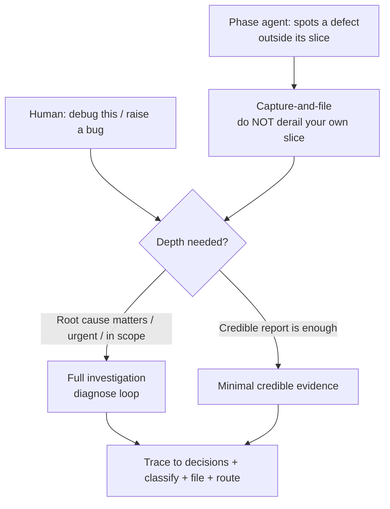
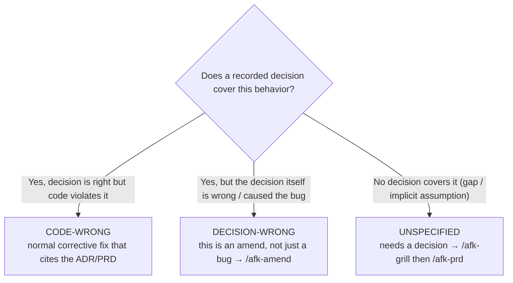

# Skill: afk-bug

A bug, in AFK terms, is **observed behavior contradicting an intended
behavior** — and in this toolkit intended behavior is *recorded*: in an
`ADR` (`docs/adr/`), a `PRD` (a tracker issue), a `CONTEXT.md` invariant,
or already-shipped (`afk-done`) code. So a bug report here is never just
"X is broken". It must answer:

1. **What breaks**, concretely, with a reproduction.
2. **Which recorded decisions** the bug violates or threatens (which ADRs,
   which PRDs, which user stories / acceptance criteria).
3. **What happens if we fix it vs. if we don't** — including which
   decisions a fix would itself touch.
4. **How urgent** it is, and **where the fix routes** back into the
   pipeline.

This skill investigates only as far as it needs to write that report
credibly, then files it and routes it. The deep-investigation mechanics
(feedback loops, bisection, hypothesis testing) are borrowed from the
universal [`diagnose`](https://www.skills.sh/) skill — read it when you
need to actually chase a root cause; this skill is about turning a
suspicion into an actionable, decision-linked tracker bug.

## Two callers, one output



> **Agent rule (read this first if you are a phase agent).** If you find a
> defect *outside* the issue you are working, do **not** fix it inline —
> that breaks the vertical slice and bloats the PR. Capture it with this
> skill, drop a one-line pointer comment on your own issue if related,
> then return to your own work and emit your normal sentinel. Never emit
> `BLOCKED` on *your* issue for an *unrelated* bug — file the bug and
> carry on. Only block if the defect actually prevents your slice.

## Step 0 — Pick your depth

- **Full investigation** — the bug is in scope, urgent (S1/S2 below), or
  the fix is impossible to recommend without a root cause. Run the
  `diagnose` loop: build a fast deterministic pass/fail signal, reproduce,
  form ranked falsifiable hypotheses, instrument, isolate the cause.
- **Capture-and-file** — you (or another agent) just need the defect on
  the record, actionable, and correctly routed. Gather *enough* evidence
  that a fresh agent or human could reproduce and act on it. Do not chase
  the root cause to ground if it isn't needed yet.

Either way you must reproduce or, if you genuinely cannot, say so
explicitly in the report and list what you tried (per `diagnose`).

## Step 1 — Build the evidence

- Capture the **exact symptom**: error text, wrong output, failing
  assertion, slow timing — verbatim, not paraphrased.
- Produce a **reproduction**: the smallest command / test / request that
  shows the failure. This is the single most valuable artifact in the
  report; a bug with a repro is most of the way fixed.
- Note **when it started** if known (commit, PR, release, config change)
  and how you know.
- Collect **resources**: relevant log lines, stack traces, the failing
  test name, links to the introducing PR/commit, screenshots for UI.

## Step 2 — Trace the bug to recorded decisions (the AFK part)

This is what makes an `afk-bug` different from a generic ticket. Read the
repo and the tracker:

- Read `CONTEXT.md` (and `CONTEXT-MAP.md`) for the affected package — does
  the bug violate a documented **invariant**?
- Read the `ADR`s in the affected `docs/adr/` — does the behavior
  contradict an accepted decision?
- Find the `PRD`(s) and merged `afk-child` issues that own this code —
  which **user story / acceptance criterion** is now false?

Then classify the bug into exactly one of three kinds — this drives
routing in Step 6:



## Step 3 — Classify severity and urgency

Severity = how bad the impact. Urgency = how fast it must be fixed. State
both; they are not the same (a cosmetic bug on a checkout button can be
urgent; a rare crash in an unused path is severe but not urgent).

| Severity | Meaning                                                        | Default response |
|----------|----------------------------------------------------------------|------------------|
| **S1**   | Data loss/corruption, security hole, prod down, money wrong    | Hotfix now; pause affected in-flight work |
| **S2**   | Core flow broken, no reasonable workaround                     | Next in queue    |
| **S3**   | Degraded behavior, a workaround exists                         | Backlog, normal slice |
| **S4**   | Cosmetic / trivial                                             | Opportunistic    |

## Step 4 — Spell out fix-vs-no-fix impact

Make the trade-off explicit and tied to decisions:

- **If NOT fixed:** which user stories stay broken, which ADR invariant
  stays violated, what the blast radius is (modules, packages, users,
  data), whether it compounds over time.
- **If fixed:** which decisions the fix would touch — does it just bring
  code back in line with an ADR (cheap), or does it force a *superseding
  ADR* / changes to an open PRD / rebase of in-flight children (route via
  `afk-amend`)? Name the affected ADR/PRD numbers.

## Step 5 — File the bug

Resolve the tracker from `.afk/config.yml` (`tracker:`, `repo:`) and open
the issue via the [`afk-tracker-issue`](../afk-tracker-issue/SKILL.md)
skill — the same `gh issue create` / `glab issue create` path `afk-prd`
uses. Do not invent CLI flags.

- **Title:** `bug(<package-or-module>): <one-line symptom>` (≤ 80 chars,
  imperative-ish, names where it hurts).
- **Labels:** always `afk-bug`. Add the routing label from Step 6
  (`ready-for-agent`, `needs-human`, …). For S1, also apply `afk-blocked`
  to any in-flight issue/PR that must pause.
- **Body:** the template below — every section filled. Vocabulary from
  `CONTEXT.md`.

```markdown
## Summary
<one sentence: what is wrong, where>

## Severity & urgency
- Severity: **S<n>** — <why>
- Urgency: <now | next | backlog> — <why>
- Kind: <CODE-WRONG | DECISION-WRONG | UNSPECIFIED>

## Observed vs expected
- Observed: <verbatim symptom>
- Expected: <what should happen, and per which decision>

## Reproduction
<smallest command / test / request that triggers it; paste the failing
output. If not reproducible, say so and list what was tried.>

## Evidence & resources
- Logs / stack trace: <snippet or link>
- Introduced by (if known): <commit / PR / release>
- Related: <PR #, dashboard link, screenshot, …>

## Affected decisions (ADRs / CONTEXT)
- ADR-XXXX "<title>": <honored-but-violated | wrong, needs superseding>
- CONTEXT invariant "<term>": <how it's broken>
- <or: no ADR covers this — candidate for /afk-grill>

## Affected specs (PRDs / stories)
- PRD #NN: user story "<…>" / acceptance criterion "<…>" now fails
- In-flight children touching this code: #NN, #NN

## Blast radius
<modules / packages / endpoints / users / data affected>

## Impact of NOT fixing
<which stories stay broken, which invariant stays violated, does it compound>

## Impact of fixing
<does the fix just realign code with the ADR, or force a superseding ADR /
PRD edit / rebase of in-flight children? name them>

## Suspected root cause
<if known from Step 1; else "unknown — needs full diagnose">

## Recommended routing
<one of the Step 6 options, with the concrete next command>

## Out of scope
<what this bug is explicitly NOT about, to stop slice creep>
```

## Step 6 — Route it back into the lifecycle

Mirror the `afk-amend` philosophy: the right action depends on the *kind*
from Step 2, not on the symptom.

- **CODE-WRONG, agent-sized fix** → label the bug `ready-for-agent` (and
  `afk-child` + a `Parent:` link if it belongs under a PRD) so `afk run`
  picks it up; the fix PR cites the ADR/PRD it restores.
- **CODE-WRONG, too big for one slice** → run [`afk-prd`](../afk-prd/SKILL.md)
  to turn it into a corrective PRD, then
  [`afk-decompose`](../afk-decompose/SKILL.md).
- **DECISION-WRONG** → this is an *amend*, not a plain fix. Hand to
  [`afk-amend`](../afk-amend/SKILL.md): a superseding ADR must land on the
  default branch first, then the corrective PRD/children follow. Leave the
  bug `needs-human` if a human must choose the new decision.
- **UNSPECIFIED** → run [`afk-grill`](../afk-grill/SKILL.md) to make the
  missing decision (new ADR), then `afk-prd`.
- **Needs a human regardless** (secret rotation, infra, license, prod
  access) → label `needs-human` and stop.

Close by telling the caller the issue number/URL, the severity, and the
single next command (e.g. *"Bug #57 filed (S2, CODE-WRONG). It violates
ADR-0012 and breaks PRD #42 story 3. Relabel `ready-for-agent` and run
`.afk/scripts/afk run`, or `/afk-amend` if you think ADR-0012 itself is
wrong."*).

## Quality gates

Before you consider the bug filed:

- [ ] The report has a **reproduction** (or an explicit, justified "cannot
      reproduce" with what was tried).
- [ ] At least one **affected ADR/PRD/CONTEXT** is named — or it is
      explicitly stated that none exists (an `UNSPECIFIED` gap).
- [ ] **Severity and urgency** are both set, with a one-line reason each.
- [ ] **Impact of fixing AND of not fixing** are both written and tied to
      decisions, not vague.
- [ ] The bug carries `afk-bug` plus exactly one routing label.
- [ ] A **single next command / route** is recommended.
- [ ] If you are a phase agent: you did **not** fix the out-of-scope
      defect inline and did **not** block your own slice over it.

## Anti-patterns

- **Bug-as-vibe** — "feels slow", "seems off" with no symptom, no repro,
  no decision link. Either build the evidence or don't file.
- **Silent in-line fix** — a phase agent "just quickly fixing" an
  unrelated defect, ballooning a vertical slice. File it instead.
- **Decision-blind report** — a bug that never says which ADR/PRD it
  breaks. That's the whole point of filing it *here* instead of a bare
  ticket.
- **Severity inflation** — everything is S1. Reserve S1 for data loss,
  security, prod-down, or money-wrong.
- **Fixing a DECISION-WRONG bug as if it were CODE-WRONG** — patching code
  to fight a still-recorded decision. The old decision will get
  re-implemented by the next agent. Supersede the ADR via `afk-amend`
  first.
