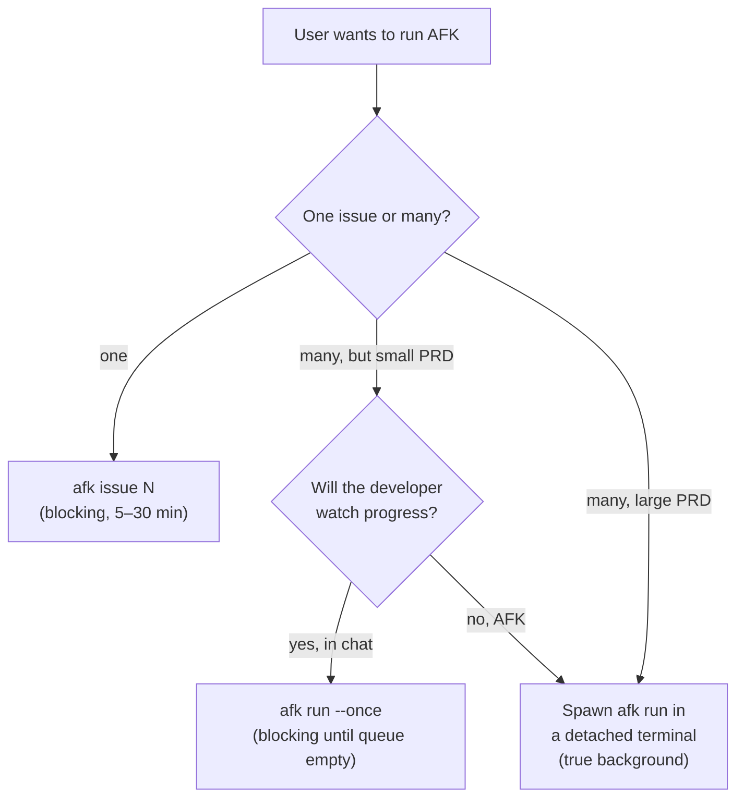

# Skill: afk-run

The shell-side counterpart of `/afk-grill` and `/afk-prd`. Whereas
`/afk-grill` turns a sketch into ADRs and `/afk-prd` turns the sketch
into a tracker PRD, **`/afk-run`** drives the actual implementation
phases from inside the chat window.

This skill is what makes "AFK from inside chat" possible without
making the user juggle a separate terminal.

## Prerequisites

- `.afk/config.yml` exists (`/afk-setup` has been run).
- The tracker has a PRD issue labelled `afk-prd, ready-for-agent`
  (`/afk-prd` has been run).
- The agent runtime can invoke shell commands. Cursor's `cursor-agent`,
  Claude Code, Codex, GitHub Copilot Chat, Windsurf and Gemini all
  support this; if it can't, fall back to the terminal mode in
  [`docs/MODES.md`](../../docs/MODES.md).

## What the user can ask for

| User says…                                  | You run…                                       |
|---------------------------------------------|------------------------------------------------|
| "Decompose PRD #42"                         | `.afk/scripts/afk decompose 42`                |
| "Run issue #43"                             | `.afk/scripts/afk issue 43`                    |
| "Process one batch and stop"                | `.afk/scripts/afk run --once`                  |
| "Run all children of PRD #42 in one pass"   | `.afk/scripts/afk run --once --prd 42`         |
| "Run AFK in the background"                 | spawn `.afk/scripts/afk run` in a fresh detached terminal (see below) |
| "What's in flight?"                         | `.afk/scripts/afk status`                      |
| "Silence the alarm"                         | `.afk/scripts/afk stop-notify`                 |
| "Document PRD #42 now"                      | `.afk/scripts/afk document`                    |

## Run-mode decision



- **Inline** (`afk issue` or `afk run --once`): runs synchronously
  inside the chat tool call. Output streams back to chat. Good for
  one issue or a small PRD (≤ ~3 children). The user can read along.
- **Detached** (`afk run` in a separate terminal): runs the
  long-lived parallel orchestrator outside chat. Good for big PRDs.
  The user is now truly AFK — they get a `notify-developer` alarm
  only when a human is needed.

## Procedure

### 1. Sanity check

Before any command, confirm the prerequisites in one parallel batch:

```bash
test -f .afk/config.yml && echo "config ok"   || echo "MISSING config — run /afk-setup"
test -d .afk/scripts    && echo "scripts ok"  || echo "MISSING scripts — run /afk-setup"
command -v gh   >/dev/null && gh   auth status 2>&1 | head -1   # if tracker=github
command -v glab >/dev/null && glab auth status 2>&1 | head -1   # if tracker=gitlab
```

If any check fails, stop and tell the user exactly what to fix
(usually: `/afk-setup` or `gh auth login`).

### 2. Show the user what you're about to do

Always restate the command before running it, with a one-line
explanation. Example:

> I'll run `.afk/scripts/afk decompose 42`. This calls the decompose
> agent (one phase), reads PRD #42, and creates 3–7 vertical-slice
> child issues on your tracker. Should take 1–3 minutes.

### 3. Run the command

For **inline** runs, use a single foreground shell call with a
generous `block_until_ms` (e.g. 30 minutes for an `issue` run).
Stream output back to the user as it arrives. Look for the sentinel
lines (`<promise>COMPLETE</promise>`, `<promise>BLOCKED</promise>`)
in the output to decide whether to celebrate or escalate.

For **detached** runs, spawn the orchestrator in a way that survives
chat ending. The exact incantation depends on the OS:

- Linux / macOS:

  ```bash
  setsid nohup .afk/scripts/afk run > .afk/logs/orchestrator.log 2>&1 < /dev/null &
  ```

- WSL: same as Linux, but verify `.afk/logs/orchestrator.log` is on
  a path Windows can see if the user wants to tail it from Windows.

After spawning, tell the user:

> AFK orchestrator started (PID: $!). Tail with:
>
>     tail -f .afk/logs/orchestrator.log
>
> Stop with:
>
>     pkill -f orchestrate.sh
>
> You'll get a `notify-developer` alarm only when something needs
> you — feel free to close the chat.

### 4. Interpret the result

After every command, read the orchestrator's stderr summary and
relay to the user in 1–3 lines:

| Sentinel / exit code | Tell the user                                    |
|----------------------|--------------------------------------------------|
| `→ COMPLETE`         | "Phase done. Moving on."                         |
| `→ NO_CHANGES`       | "Nothing to do here. Skipping."                  |
| `→ BLOCKED: <reason>`| "Blocked — `<reason>`. Want me to investigate?"  |
| Exit 0 from `run`    | "Queue drained. Run `afk status` for snapshot."  |
| Exit 30 (crashed)    | "Agent crashed. Last log: `.afk/logs/...`"       |

Always offer the **next action** as a single button-press question
(do not list 5 options) — e.g. "Want me to retry `afk issue 43`?".

### 5. After the run

If a PRD's children all closed during the run, the orchestrator's
internal docs-gate scan will automatically queue the `document`
phase. Tell the user this so they don't think the run hung:

> Children done. The orchestrator will draft dev + user docs in
> ~5 min and open a docs PR. I'll let you know when it merges.

## What you should NOT do

- **Don't** invoke `gh` / `glab` directly — go through
  `.afk/scripts/afk` so the tracker abstraction stays intact.
- **Don't** edit `.afk/state/` files by hand mid-run. Use
  `.afk/scripts/afk` subcommands or, for surgical fixes, the
  recipes in `docs/EXTENDING.md#troubleshooting`.
- **Don't** repeatedly poll `afk status` while a run is in flight.
  Run it once, and rely on the sentinel output of the foreground
  command for progress.
- **Don't** spawn `afk run` (long-form) as a foreground shell call.
  It will dominate the chat session forever. Use `--once` for
  foreground or detach with `setsid nohup`.

## Failure modes

- **`afk: command not found`** — `.afk/scripts/afk` is missing or
  not executable. Run `chmod +x .afk/scripts/afk` or re-run
  `/afk-setup`.
- **`config.yml` not found** — user is in the wrong cwd. Confirm
  with `pwd` and ask the user to switch.
- **All children blocked** — usually a tracker auth issue or a
  malformed PRD. Read the most recent `.afk/logs/*-latest/*.log`
  before suggesting a fix.
- **Orchestrator detached but no output** — the agent runner
  (`cursor-agent`, `claude`, …) is missing on `$PATH`. Check
  `agent_bin` in `.afk/config.yml`.
